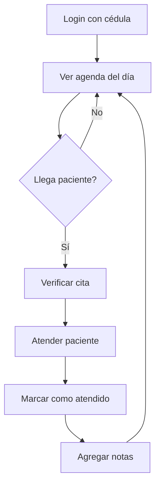

# 👨‍⚕️ Portal de Doctores - Guía de Acceso

## Acceso al Portal

Los médicos pueden acceder a su portal personal para gestionar su agenda y citas.

---

## 🔐 Credenciales de Acceso

### URL de Acceso
```
https://biosanarcall.site/doctor-login
```

### Credenciales
- **Usuario**: Cédula del médico (documento)
- **Contraseña**: Configurada por el administrador

---

## 🔑 Gestión de Contraseñas

### Primera Vez
1. El administrador crea la contraseña inicial desde el módulo de Médicos
2. Se envía la contraseña por SMS o email al doctor
3. El doctor puede cambiarla después del primer login

### Cambiar Contraseña (Admin)
1. Ir a **Médicos** en el menú lateral
2. Buscar al médico por nombre o cédula
3. Clic en **Cambiar contraseña**
4. Ingresar nueva contraseña (mínimo 6 caracteres)
5. Confirmar

### Recuperar Contraseña
Si un médico olvida su contraseña:
1. El admin puede generar una nueva desde el panel
2. El sistema enviará la nueva contraseña por SMS

---

## 📋 Funciones del Portal Doctor

### Ver Agenda
- Calendario con citas programadas
- Vista por día, semana o mes
- Pacientes agendados con sus datos

### Gestionar Citas
- Ver detalles de cada cita
- Marcar paciente como atendido
- Agregar notas de consulta

### Configuración
- Actualizar datos de contacto
- Cambiar contraseña

---

## 🖥️ Interfaz del Portal

```
┌─────────────────────────────────────────────┐
│  FUNDACIÓN BIOSANAR IPS - Portal Médico    │
├─────────────────────────────────────────────┤
│                                             │
│  Bienvenido, Dr. [Nombre]                   │
│                                             │
│  📅 Mi Agenda    📊 Estadísticas           │
│                                             │
│  ┌─────────────────────────────────────┐   │
│  │ Citas de Hoy: 15                     │   │
│  │ Pendientes: 8                        │   │
│  │ Atendidos: 7                         │   │
│  └─────────────────────────────────────┘   │
│                                             │
│  Próximas Citas:                           │
│  ┌─────────────────────────────────────┐   │
│  │ 08:00 - María García - Cédula 123   │   │
│  │ 08:30 - Juan Pérez - Cédula 456     │   │
│  │ ...                                  │   │
│  └─────────────────────────────────────┘   │
└─────────────────────────────────────────────┘
```

---

## 🔄 Flujo de Trabajo del Doctor



---

## ❓ Preguntas Frecuentes

### ¿Cómo cambio mi contraseña?
Una vez dentro del portal, ve a **Configuración** > **Cambiar contraseña**

### ¿Puedo ver citas de otros días?
Sí, usa el selector de fecha en la parte superior del calendario

### ¿Cómo agrego una nota a la consulta?
Al marcar la cita como "Atendida", aparece un campo para agregar notas

### ¿Qué hago si no puedo entrar?
Contacta al administrador para restablecer tu contraseña

---

## 📱 Acceso Móvil

El portal es responsive y funciona en:
- Computadores
- Tablets
- Teléfonos móviles

Simplemente accede a la URL desde el navegador de tu dispositivo.

---

*Guía actualizada: Enero 2026*
