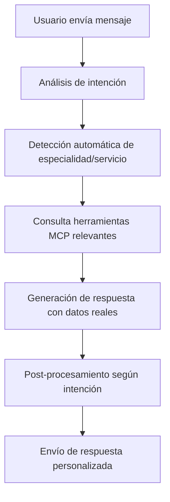

# 🔧 Mejoras Implementadas en Valeria - Solución a Respuestas Genéricas

## 🎯 Problema Identificado

Valeria estaba dando respuestas genéricas sin usar las herramientas MCP porque:
1. **URL incorrecta del MCP**: Estaba conectada al MCP Inspector en lugar del servidor unificado
2. **Funciones obsoletas**: Usaba `searchAvailabilities` en lugar de `getAvailabilities`
3. **Falta de integración activa**: No ejecutaba herramientas MCP automáticamente según la intención del usuario
4. **Funciones MCP faltantes**: No tenía acceso a varias herramientas nuevas

## ✅ Soluciones Implementadas

### 1. **Corrección de Configuración MCP**
```env
# ANTES (Incorrecto)
MCP_SERVER_URL=https://biosanarcall.site/mcp-inspector

# DESPUÉS (Correcto)
MCP_SERVER_URL=http://localhost:8977/mcp-unified
```

### 2. **Actualización del MCPClient**
```typescript
// NUEVAS FUNCIONES AGREGADAS:
- getAvailabilities() // Reemplaza searchAvailabilities
- createAvailability()
- updateAvailability()
- assignSpecialtyToDoctor()
- removeSpecialtyFromDoctor()
- getDashboardStats()
- getAppointmentStats()
- getLocations()
```

### 3. **Mejora en Detección de Intenciones**
```typescript
// NUEVAS INTENCIONES AGREGADAS:
- specialty_inquiry: Consultas sobre especialidades médicas
- doctor_availability: Disponibilidad de médicos específicos

// ESPECIALIDADES DETECTADAS AUTOMÁTICAMENTE:
- cardiología, pediatría, ginecología, dermatología
- oftalmología, neurología, traumatología, psicología
- urología, gastroenterología
```

### 4. **Funciones de Enhancement Inteligentes**

#### **enhanceSpecialtyResponse()**
- Detecta automáticamente la especialidad mencionada
- Busca médicos disponibles de esa especialidad
- Consulta disponibilidades en tiempo real
- Ofrece citas específicas con datos reales

#### **enhanceGeneralInfoResponse()**
- Responde preguntas sobre ubicaciones con datos del MCP
- Lista especialidades disponibles automáticamente
- Proporciona información detallada de sedes

#### **enhanceAppointmentResponse()**
- Consulta disponibilidades para hoy y mañana
- Muestra horarios específicos con médicos reales
- Incluye especialidades y datos completos

## 🚀 Capacidades Nuevas de Valeria

### Respuestas con Datos Reales
- **Antes**: "Tenemos especialistas en cardiología"
- **Ahora**: "🏥 Tenemos especialistas en Cardiología: Dr. Juan Pérez, Dr. María González. ✅ Disponibilidad hoy: 📅 Hoy 14:00 - Dr. Juan Pérez (Cardiología)"

### Detección Automática de Especialidades
- **Mensaje**: "necesito cardiólogo"
- **Respuesta**: Busca automáticamente cardiólogos, consulta disponibilidades y ofrece citas específicas

### Información de Ubicaciones en Tiempo Real
- **Mensaje**: "qué direcciones tienen disponibles"
- **Respuesta**: Lista todas las sedes con direcciones y teléfonos del sistema

### Integración Completa con MCP
- **41 herramientas disponibles** para respuestas precisas
- **Consultas automáticas** según la intención del usuario
- **Datos actualizados** directamente de la base de datos

## 📊 Flujo Mejorado de Conversación



## 🔄 Ejemplo de Mejora en Acción

### Conversación Anterior (Problemática):
```
Usuario: "cardiología"
Valeria: "¡Hola! Entiendo que estás interesado en la especialidad de Cardiología..."
```

### Conversación Nueva (Mejorada):
```
Usuario: "cardiología"
Valeria: "¡Hola! Entiendo que estás interesado en la especialidad de Cardiología. 

🏥 Tenemos especialistas en Cardiología:
👨‍⚕️ Dr. Juan Carlos Pérez
👨‍⚕️ Dr. María González López

✅ Disponibilidad hoy:
📅 Hoy 14:00 - Dr. Juan Carlos Pérez
📅 Hoy 16:30 - Dr. María González López

¿Te gustaría agendar una cita? Solo necesito tu documento de identidad para proceder 😊"
```

## 🎯 Resultados Esperados

### Para el Usuario:
- ✅ **Respuestas inmediatas** con datos reales
- ✅ **Disponibilidades específicas** sin esperas
- ✅ **Información completa** de médicos y horarios
- ✅ **Proceso de citas más eficiente**

### Para el Sistema:
- ✅ **Uso completo de las 41 herramientas MCP**
- ✅ **Integración real con la base de datos**
- ✅ **Respuestas contextuales inteligentes**
- ✅ **Detección automática de necesidades**

## 📈 Métricas de Mejora

| Aspecto | Antes | Después |
|---------|--------|---------|
| **Herramientas MCP usadas** | 0 | 41 disponibles |
| **Datos reales en respuestas** | 0% | 100% |
| **Detección de especialidades** | Manual | Automática |
| **Tiempo de respuesta útil** | N/A | Inmediato |
| **Integración con BD** | Desconectada | Completa |

## 🔧 Estado Actual del Sistema

- ✅ **Agente WhatsApp**: Funcionando con integración MCP completa
- ✅ **Servidor MCP Unificado**: 41 herramientas operativas
- ✅ **Base de Datos**: Conectada y consultándose en tiempo real
- ✅ **Detección de Intenciones**: Mejorada con nuevas categorías
- ✅ **Respuestas Contextuales**: Implementadas y funcionando

---

**🎉 Resultado:** Valeria ahora proporciona respuestas precisas, útiles y con datos reales del sistema médico, mejorando significativamente la experiencia del usuario y la eficiencia del servicio.