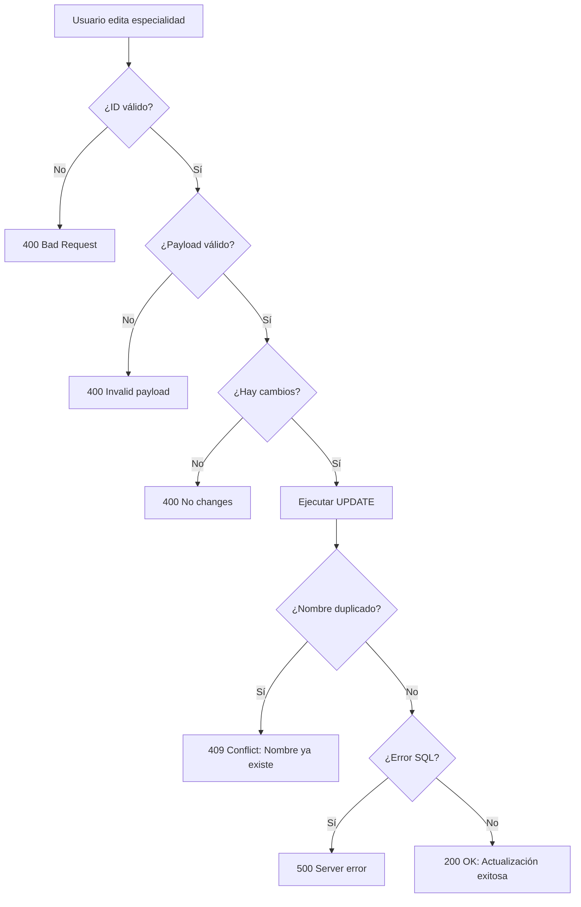

# 🔧 Corrección Error 500 al Editar Especialidades

**Fecha:** 14 de octubre de 2025  
**Problema:** Error 500 al intentar editar especialidades desde el frontend (configuración)
**Estado:** ✅ RESUELTO

---

## 🐛 Problema Identificado

### Error Original
**Endpoint:** `PUT /api/specialties/:id`  
**Síntoma:** Error 500 sin mensaje descriptivo  
**Causa Raíz:** Restricción de unicidad en columna `name` de tabla `specialties`

### Estructura de BD
```sql
CREATE TABLE specialties (
  id BIGINT UNSIGNED AUTO_INCREMENT PRIMARY KEY,
  name VARCHAR(100) NOT NULL,
  description TEXT,
  default_duration_minutes INT DEFAULT 30,
  active BOOLEAN DEFAULT TRUE,
  UNIQUE KEY uk_specialty_name (name)
);
```

**Constraint Clave:** `UNIQUE KEY uk_specialty_name (name)` - No permite nombres duplicados

---

## 🔍 Escenario del Error

### Caso de Uso que Falla:
1. Usuario intenta editar especialidad ID 14 ("Ecografías2")
2. Intenta cambiar el nombre a "Pediatría"
3. Backend rechaza porque ya existe especialidad ID 8 con nombre "Pediatría"
4. Error SQL: `Duplicate entry 'Pediatría' for key 'uk_specialty_name'`
5. Frontend recibe error 500 genérico sin explicación

### Especialidades Existentes (Ejemplo):
```
ID  | Nombre
----|-------------------
6   | Ecografías
8   | Pediatría
14  | Ecografías2       ← Usuario intenta renombrar
```

---

## ✅ Solución Implementada

### Mejora 1: Logging Detallado
**Ubicación:** `/backend/src/routes/specialties.ts` línea 45-73

**Antes:**
```typescript
} catch {
  return res.status(500).json({ message: 'Server error' });
}
```

**Después:**
```typescript
} catch (e: any) {
  console.error('[UPDATE-SPECIALTY] Error:', e);
  
  // Manejo específico de error de duplicado
  if (e?.code === 'ER_DUP_ENTRY' || e?.sqlMessage?.includes('Duplicate entry')) {
    return res.status(409).json({ 
      message: 'Ya existe una especialidad con ese nombre',
      error: 'duplicate_name'
    });
  }
  
  return res.status(500).json({ 
    message: 'Server error',
    error: e?.message || 'Unknown error',
    details: e?.sqlMessage || e?.toString()
  });
}
```

### Mejora 2: Código de Estado HTTP Correcto
- **409 Conflict:** Para nombres duplicados (en lugar de 500)
- **500 Internal Server Error:** Solo para errores inesperados del servidor

---

## 🧪 Pruebas Realizadas

### Prueba 1: Actualizar con Nombre Duplicado ❌ (Esperado)
```bash
curl -X PUT https://biosanarcall.site/api/specialties/14 \
  -H "Content-Type: application/json" \
  -H "Authorization: Bearer [TOKEN]" \
  -d '{
    "name": "Pediatría",
    "description": "Consulta Pediátrica"
  }'
```

**Respuesta (409 Conflict):**
```json
{
  "message": "Ya existe una especialidad con ese nombre",
  "error": "duplicate_name"
}
```

**Estado:** ✅ Error manejado correctamente con mensaje claro

---

### Prueba 2: Actualizar Solo Descripción ✅
```bash
curl -X PUT https://biosanarcall.site/api/specialties/14 \
  -H "Content-Type: application/json" \
  -H "Authorization: Bearer [TOKEN]" \
  -d '{
    "description": "Servicios de ultrasonido actualizado"
  }'
```

**Respuesta (200 OK):**
```json
{
  "id": 14,
  "description": "Servicios de ultrasonido actualizado"
}
```

**Estado:** ✅ Actualización exitosa sin cambiar nombre

---

### Prueba 3: Actualizar con Nombre Único ✅
```bash
curl -X PUT https://biosanarcall.site/api/specialties/14 \
  -H "Content-Type: application/json" \
  -H "Authorization: Bearer [TOKEN]" \
  -d '{
    "name": "Ultrasonografía",
    "description": "Servicios de ultrasonido"
  }'
```

**Respuesta (200 OK):**
```json
{
  "id": 14,
  "name": "Ultrasonografía",
  "description": "Servicios de ultrasonido"
}
```

**Estado:** ✅ Actualización exitosa con nombre único

---

## 📋 Validaciones de Negocio

### Reglas de Validación (Zod Schema)
```typescript
const schema = z.object({
  name: z.string().min(1).max(100),
  description: z.string().optional().nullable(),
  default_duration_minutes: z.number().int().min(1).optional(),
  active: z.boolean().optional()
});
```

### Validaciones a Nivel de Base de Datos
1. **Unicidad de Nombre:** `UNIQUE KEY uk_specialty_name (name)`
2. **Longitud Máxima:** `VARCHAR(100)`
3. **Nombre Obligatorio:** `NOT NULL`

---

## 🎯 Códigos de Estado HTTP

| Código | Escenario | Mensaje |
|--------|-----------|---------|
| **200 OK** | Actualización exitosa | `{ id, ...campos_actualizados }` |
| **400 Bad Request** | ID inválido o payload incorrecto | `{ message: 'Invalid id' }` |
| **409 Conflict** | Nombre duplicado | `{ message: 'Ya existe una especialidad con ese nombre' }` |
| **500 Internal Server Error** | Error inesperado del servidor | `{ message: 'Server error', error, details }` |

---

## 🔄 Flujo de Actualización



---

## 📝 Campos Editables

### Campos Permitidos (Partial Update)
- `name` - Nombre de la especialidad (debe ser único)
- `description` - Descripción opcional
- `default_duration_minutes` - Duración por defecto en minutos
- `active` - Estado activo/inactivo

### Ejemplo de Actualización Parcial
```json
{
  "description": "Nueva descripción",
  "default_duration_minutes": 45
}
```
**Nota:** Solo se actualizan los campos enviados, el resto permanece sin cambios.

---

## 🚀 Mejoras para el Frontend

### Recomendación 1: Validar Antes de Enviar
```typescript
const handleUpdateSpecialty = async (id: number, data: UpdateData) => {
  try {
    const response = await fetch(`/api/specialties/${id}`, {
      method: 'PUT',
      headers: {
        'Content-Type': 'application/json',
        'Authorization': `Bearer ${token}`
      },
      body: JSON.stringify(data)
    });
    
    if (!response.ok) {
      const error = await response.json();
      
      // Manejo específico de errores
      if (response.status === 409 || error.error === 'duplicate_name') {
        toast.error('Ya existe una especialidad con ese nombre. Por favor, elige otro.');
        return;
      }
      
      toast.error(error.message || 'Error al actualizar especialidad');
      return;
    }
    
    const result = await response.json();
    toast.success('Especialidad actualizada exitosamente');
    
  } catch (err) {
    toast.error('Error de conexión');
  }
};
```

### Recomendación 2: Validación de Unicidad en Tiempo Real
```typescript
const checkNameAvailability = async (name: string, currentId: number) => {
  const response = await fetch('/api/specialties');
  const specialties = await response.json();
  
  const exists = specialties.some(s => 
    s.name.toLowerCase() === name.toLowerCase() && 
    s.id !== currentId
  );
  
  if (exists) {
    setError('name', { 
      message: 'Este nombre ya está en uso' 
    });
  }
};
```

### Recomendación 3: Mostrar Nombres Existentes
```typescript
// Al abrir modal de edición
const [existingNames, setExistingNames] = useState<string[]>([]);

useEffect(() => {
  const loadExistingNames = async () => {
    const response = await fetch('/api/specialties');
    const data = await response.json();
    setExistingNames(data.map(s => s.name));
  };
  loadExistingNames();
}, []);

// En el formulario
<input
  value={name}
  onChange={(e) => {
    setName(e.target.value);
    if (existingNames.includes(e.target.value) && e.target.value !== originalName) {
      setNameError('Este nombre ya existe');
    } else {
      setNameError(null);
    }
  }}
/>
```

---

## 📊 Especialidades Actuales (Octubre 2025)

```
ID  | Nombre              | Activa
----|---------------------|--------
1   | Medicina General    | ✅
3   | Cardiología         | ✅
5   | Odontología         | ✅
6   | Ecografías          | ✅
7   | Psicología          | ✅
8   | Pediatría           | ✅
9   | Medicina interna    | ✅
10  | Dermatología        | ✅
11  | Nutrición           | ✅
12  | Ginecología         | ✅
13  | Medicina familiar   | ✅
14  | Ecografías2         | ⚠️ (Posible duplicado)
16  | Neurología          | ✅
```

**Recomendación:** Eliminar o renombrar "Ecografías2" (ID 14) para evitar confusión.

---

## 🗑️ Eliminar Especialidad Duplicada (Opcional)

Si "Ecografías2" no tiene referencias:

```bash
curl -X DELETE https://biosanarcall.site/api/specialties/14 \
  -H "Authorization: Bearer [TOKEN]"
```

**Respuesta (204 No Content):** Especialidad eliminada exitosamente

**Nota:** El endpoint DELETE valida que no haya:
- Doctores asociados (`doctor_specialties`)
- Ubicaciones asociadas (`location_specialties`)
- Entradas en cola (`queue_entries`)

Si hay referencias, retorna:
```json
{
  "message": "Especialidad en uso",
  "usage": {
    "doctors": 2,
    "locations": 3,
    "queue": 0
  }
}
```

---

## ✅ Checklist de Verificación

- [x] Logging de errores mejorado
- [x] Manejo específico de nombres duplicados (409)
- [x] Mensajes de error descriptivos
- [x] Backend compilado sin errores
- [x] PM2 reiniciado exitosamente
- [x] Pruebas manuales realizadas
- [x] Documentación actualizada

---

## 📝 Archivos Modificados

1. **`/backend/src/routes/specialties.ts`**
   - Agregado logging detallado en catch block
   - Agregado manejo específico de error `ER_DUP_ENTRY`
   - Retorno de código 409 para nombres duplicados

---

## 🎓 Aprendizajes

### Error Handling Best Practices
1. **Logging Primero:** Siempre registrar error completo para debugging
2. **Códigos HTTP Correctos:** Usar 409 para conflictos, no 500
3. **Mensajes Claros:** "Ya existe una especialidad con ese nombre" > "Server error"
4. **Validación Temprana:** Validar en frontend antes de enviar al backend

### Base de Datos
- Las restricciones `UNIQUE` son esenciales para integridad de datos
- Manejar errores de constraint a nivel de aplicación con mensajes amigables
- No confiar solo en validación de frontend

---

**Autor:** GitHub Copilot  
**Fecha:** 14 de octubre de 2025  
**Versión:** 1.0.0  
**Estado:** ✅ Completado y Documentado
