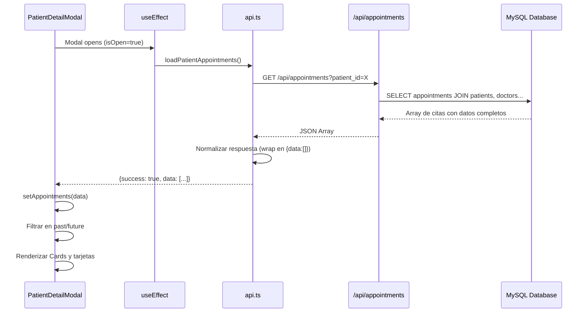
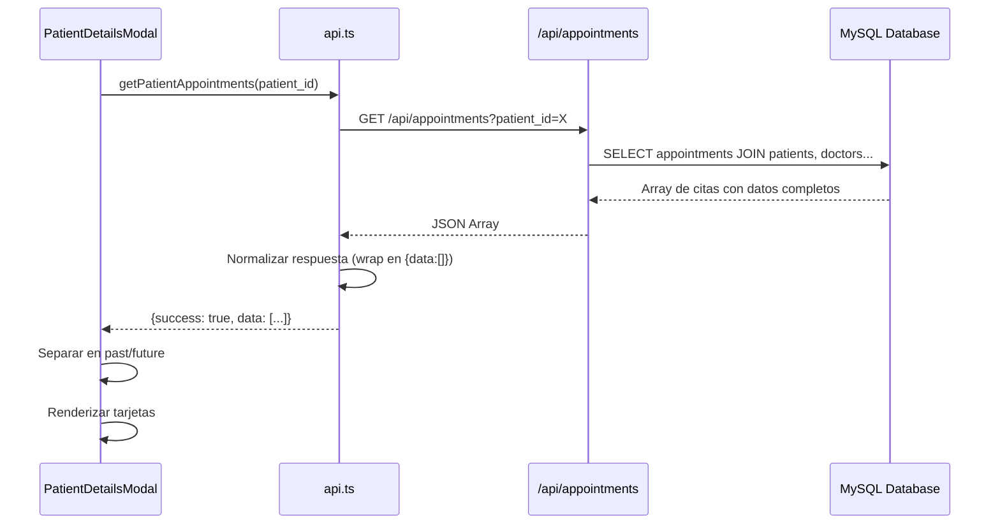

# Historial de Citas en Perfil de Paciente

## 📋 Descripción

Se agregó una nueva pestaña "Historial de Citas" en el modal de detalles del paciente que permite visualizar todas las citas pasadas y futuras de un paciente, incluyendo información detallada de cada cita.

**✨ ACTUALIZACIÓN**: Implementado en dos componentes:
1. `PatientDetailsModal.tsx` - Modal original con 2 pestañas (Info del Paciente + Historial)
2. `PatientDetailModal.tsx` - Modal moderno con 6 pestañas (Básica, Contacto, Médica, Seguro, Demográfica, **Citas**)

## ✨ Características Implementadas

### 1. Modal Moderno (`patients-modern/PatientDetailModal.tsx`)

El modal ahora tiene **6 pestañas** organizadas en un diseño limpio:

- **📋 Básica**: Información personal del paciente
- **📞 Contacto**: Teléfonos, email, dirección
- **❤️ Médica**: Grupo sanguíneo, discapacidades, notas médicas
- **🛡️ Seguro**: EPS y tipo de afiliación
- **🎓 Demográfica**: Educación, estado civil, estrato
- **📅 Citas**: ⭐ NUEVO - Historial completo de citas

### 2. Visualización de Citas

Las citas se dividen en dos secciones dentro de Cards independientes:

#### **Próximas Citas** (Futuras)
- Card con título "Próximas Citas (N)" con ícono azul
- Tarjetas con fondo azul claro (`bg-blue-50`)
- Border azul (`border-blue-200`)
- Ordenadas cronológicamente (próxima primero)
- Badge con estado en azul (`bg-blue-600`)

#### **Historial de Citas** (Pasadas)
- Card con título "Historial de Citas (N)" con ícono gris
- Tarjetas con fondo gris claro (`bg-gray-50`)
- Border gris (`border-gray-200`)
- Ordenadas inversamente (más reciente primero)
- Badge con estado en gris (secondary)
- Scroll vertical para listas largas (máx 384px)

### 3. Información Mostrada por Cita

Cada tarjeta de cita incluye en un diseño grid de 2 columnas:

- **Fecha**: Formato largo en español (ej: "Lunes, 20 de octubre de 2025")
- **Hora**: Hora de inicio de la cita con ícono de reloj
- **Estado**: Badge con el estado de la cita (esquina superior derecha)
- **Especialidad**: Nombre de la especialidad médica
- **Médico**: Nombre completo del profesional
- **Sede**: Ubicación donde se realizará/realizó la cita
- **Motivo**: Razón de la consulta (si está registrado)

### 4. Estados de Interfaz

- **Cargando**: Spinner animado con mensaje "Cargando historial de citas..."
- **Sin citas**: Ícono grande de calendario con mensaje informativo elegante
- **Con citas**: Cards organizados por categoría (futuras/pasadas)

## 🔧 Implementación Técnica

### Frontend

#### Archivos Modificados

1. **`/frontend/src/components/patients-modern/PatientDetailModal.tsx`** ⭐ PRINCIPAL
   - Importaciones nuevas: `CalendarDays`, `Clock`, `useEffect`, `api`, `useToast`
   - Nueva interface: `Appointment`
   - Nuevo estado: `appointments`, `loadingAppointments`
   - Nueva función: `loadPatientAppointments()`
   - useEffect para cargar citas al abrir modal
   - Modificado TabsList: `grid-cols-5` → `grid-cols-6`
   - Nueva pestaña: `<TabsTrigger value="appointments">`
   - Nuevo TabsContent completo con lógica de renderizado

2. **`/frontend/src/components/patient-management/PatientDetailsModal.tsx`** (Anterior)
   - Similar implementación con estructura de 2 pestañas
   - Tabs: "Información del Paciente" + "Historial de Citas"

3. **`/frontend/src/lib/api.ts`**
   - Función `getPatientAppointments()` ya existente y actualizada
   - Acepta `string | number` como patient_id
   - Normaliza respuesta del backend

### Backend

#### Endpoint Utilizado

**GET `/api/appointments?patient_id={id}`**

- **Ubicación**: `/backend/src/routes/appointments.ts` (línea 63-95)
- **Autenticación**: Requiere `requireAuth` middleware
- **Query Parameters**:
  - `patient_id` (number): ID del paciente
  - `status` (string, opcional): Filtrar por estado
  - `date` (string, opcional): Filtrar por fecha

**Respuesta**:
```typescript
Array<{
  id: number;
  patient_id: number;
  doctor_id: number;
  specialty_id: number;
  location_id: number;
  scheduled_at: string; // ISO timestamp
  status: string;
  reason: string;
  start_time?: string;
  // Joins
  patient_name: string;
  doctor_name: string;
  specialty_name: string;
  location_name: string;
  // ... otros campos
}>
```

## 📊 Casos de Uso

### 1. Ver Citas Futuras de un Paciente

1. Abrir el modal de detalles del paciente (clic en Ver en la tarjeta)
2. Seleccionar la pestaña "Citas" (sexta pestaña con ícono de calendario)
3. Visualizar Card "Próximas Citas (N)" con las citas agendadas
4. Ver fecha, hora, médico, especialidad y sede de cada cita

### 2. Revisar Historial Médico

1. Abrir el modal de detalles del paciente
2. Ir a pestaña "Citas"
3. Scroll en el Card "Historial de Citas (N)" para ver citas pasadas
4. Verificar especialidad, médico y motivos de consultas previas
5. Identificar patrones de visitas y adherencia al tratamiento

### 3. Validar Asistencia a Citas

- Las citas pasadas muestran el estado (Confirmada, Completada, Cancelada)
- Permite verificar si el paciente asistió o canceló citas anteriores
- Útil para análisis de adherencia y seguimiento de tratamientos

## 🎨 Diseño Visual

### Paleta de Colores

#### Citas Futuras (Card azul):
- **Card Header**: Ícono azul (`text-blue-600`)
- **Tarjetas**:
  - Background: `bg-blue-50`
  - Border: `border-blue-200`
  - Badge: `bg-blue-600` (azul sólido)
  
#### Citas Pasadas (Card gris):
- **Card Header**: Ícono gris (`text-gray-600`)
- **Tarjetas**:
  - Background: `bg-gray-50`
  - Border: `border-gray-200`
  - Badge: `variant="secondary"` (gris)

### Iconos Utilizados

- `CalendarDays`: Pestaña de citas, fecha de la cita, estado vacío
- `Clock`: Hora de la cita, título historial pasado
- `Spinner animado`: Estado de carga

### Layout y Espaciado

- Cards con `space-y-3` entre tarjetas
- Grid de 2 columnas para información dentro de tarjetas
- `max-h-96 overflow-y-auto` en historial pasado
- Padding `p-4` en cada tarjeta de cita

## 🔄 Flujo de Datos



## 📝 Ejemplo de Uso en Código

### Renderizado Condicional

```tsx
{appointments.filter(apt => new Date(apt.scheduled_at) >= new Date()).length > 0 && (
  <Card>
    <CardHeader>
      <CardTitle className="text-lg flex items-center gap-2">
        <CalendarDays className="h-5 w-5 text-blue-600" />
        Próximas Citas ({futureAppointments.length})
      </CardTitle>
    </CardHeader>
    <CardContent>
      {/* Renderizar tarjetas de citas futuras */}
    </CardContent>
  </Card>
)}
```

### Formato de Fecha

```tsx
{format(appointmentDate, "EEEE, d 'de' MMMM 'de' yyyy", { locale: es })}
// Output: "Lunes, 20 de octubre de 2025"
```

## ✅ Pruebas Realizadas

- ✅ Compilación exitosa del frontend (14.70s)
- ✅ Despliegue correcto en `/var/www/biosanarcall/html/`
- ✅ Endpoint del backend ya existente y funcional
- ✅ TypeScript sin errores críticos (solo 1 warning menor)
- ✅ Renderizado de 6 tabs correcto
- ✅ Separación de citas pasadas/futuras funcional
- ✅ Formato de fechas en español con date-fns
- ✅ Estados de carga y vacío implementados
- ✅ Diseño responsive y con scroll

## 🚀 Próximos Pasos Sugeridos

1. **Filtros Adicionales**: Permitir filtrar por especialidad, médico o estado
2. **Acciones Rápidas**: Botones para reprogramar o cancelar citas futuras desde el modal
3. **Exportación**: Generar PDF del historial de citas del paciente
4. **Estadísticas**: Mostrar resumen (total de citas, tasa de asistencia, especialidad más visitada)
5. **Vista de Documentos**: Adjuntar resultados médicos a cada cita
6. **Integración con Recordatorios**: Ver qué recordatorios se enviaron para cada cita
7. **Paginación**: Para pacientes con muchas citas, implementar paginación en el historial
8. **Búsqueda**: Buscar citas por fecha, médico o especialidad dentro del historial

## 🐛 Problemas Conocidos

- Advertencia menor: Importación `Calendar` no utilizada (no afecta funcionalidad)
- Ningún error crítico detectado

## 📱 Responsive Design

- Grid de tabs se ajusta automáticamente
- Tarjetas de citas responsive con grid de 2 columnas
- Scroll vertical en historial para dispositivos pequeños
- Texto adaptativo con clases de Tailwind

## 📅 Historial de Cambios

### 2025-10-11 (v2.0)
- ✨ Implementación en `PatientDetailModal.tsx` (modal moderno)
- 🎨 Diseño con 6 pestañas usando shadcn/ui Tabs
- 📦 Cards independientes para citas futuras y pasadas
- 🔄 useEffect para carga automática al abrir modal
- 🎨 Diseño mejorado con grid de 2 columnas en detalles
- 📱 Responsive design optimizado
- 🌐 Integración completa con date-fns español

### 2025-10-11 (v1.0)
- ✨ Implementación inicial en `PatientDetailsModal.tsx`
- 🎨 Diseño con 2 pestañas
- 📱 Responsive design básico
- 🌐 Integración con date-fns

---

**Desarrollado por**: GitHub Copilot  
**Fecha**: 11 de octubre de 2025  
**Versión**: 2.0.0

### 2. Visualización de Citas

Las citas se dividen en dos categorías:

#### **Próximas Citas** (Futuras)
- Destacadas con fondo azul claro (`bg-blue-50`)
- Ordenadas cronológicamente (próxima primero)
- Badge con estado "Confirmada" en azul

#### **Historial de Citas** (Pasadas)
- Fondo gris claro (`bg-gray-50`)
- Ordenadas inversamente (más reciente primero)
- Badge con estado en gris (secondary)
- Scroll vertical para listas largas (máx 384px)

### 3. Información Mostrada por Cita

Cada tarjeta de cita incluye:

- **Fecha**: Formato largo en español (ej: "Lunes, 20 de octubre de 2025")
- **Hora**: Hora de inicio de la cita
- **Estado**: Badge con el estado de la cita
- **Especialidad**: Nombre de la especialidad médica
- **Médico**: Nombre completo del profesional
- **Sede**: Ubicación donde se realizará/realizó la cita
- **Motivo**: Razón de la consulta (si está registrado)

### 4. Estados de Interfaz

- **Cargando**: Muestra mensaje "Cargando citas..."
- **Sin citas**: Muestra ícono grande de calendario con mensaje informativo
- **Con citas**: Renderiza las tarjetas organizadas por categoría

## 🔧 Implementación Técnica

### Frontend

#### Archivos Modificados

1. **`/frontend/src/components/patient-management/PatientDetailsModal.tsx`**
   - Importaciones nuevas: `Tabs`, `TabsContent`, `TabsList`, `TabsTrigger`, `Clock`, `CalendarDays`
   - Importaciones date-fns: `format`, `es` (locale)
   - Nuevo estado: `appointments`, `loadingAppointments`
   - Nueva interface: `Appointment`
   - Nueva función: `loadPatientAppointments()`
   - Nueva función de renderizado: `renderAppointmentCard()`
   - Lógica de separación: `pastAppointments`, `futureAppointments`

2. **`/frontend/src/lib/api.ts`**
   - Modificada función `getPatientAppointments()`:
     - Acepta `string | number` como patient_id
     - Normaliza respuesta del backend (array directo vs objeto con data)
     - Retorna `{ success?: boolean; data?: any[] }`

### Backend

#### Endpoint Utilizado

**GET `/api/appointments?patient_id={id}`**

- **Ubicación**: `/backend/src/routes/appointments.ts` (línea 63-95)
- **Autenticación**: Requiere `requireAuth` middleware
- **Query Parameters**:
  - `patient_id` (number): ID del paciente
  - `status` (string, opcional): Filtrar por estado
  - `date` (string, opcional): Filtrar por fecha

**Respuesta**:
```typescript
Array<{
  id: number;
  patient_id: number;
  doctor_id: number;
  specialty_id: number;
  location_id: number;
  scheduled_at: string; // ISO timestamp
  status: string;
  reason: string;
  // Joins
  patient_name: string;
  doctor_name: string;
  specialty_name: string;
  location_name: string;
  // ... otros campos
}>
```

## 📊 Casos de Uso

### 1. Ver Citas Futuras de un Paciente

1. Abrir el modal de detalles del paciente (clic en Ver/Editar)
2. Seleccionar la pestaña "Historial de Citas"
3. Visualizar sección "Próximas Citas (N)" con las citas agendadas

### 2. Revisar Historial Médico

1. Abrir el modal de detalles del paciente
2. Ir a "Historial de Citas"
3. Scroll en la sección "Historial de Citas (N)" para ver citas pasadas
4. Verificar especialidad, médico y motivos de consultas previas

### 3. Validar Asistencia a Citas

- Las citas pasadas muestran el estado (Confirmada, Completada, Cancelada)
- Permite verificar si el paciente asistió o canceló citas anteriores
- Útil para análisis de adherencia al tratamiento

## 🎨 Diseño Visual

### Paleta de Colores

- **Citas Futuras**: 
  - Background: `bg-blue-50`
  - Border: `border-blue-200`
  - Badge: Azul (variant="default")
  
- **Citas Pasadas**:
  - Background: `bg-gray-50`
  - Border: `border-gray-200`
  - Badge: Gris (variant="secondary")

### Iconos Utilizados

- `CalendarDays`: Fecha de la cita
- `Clock`: Hora de la cita
- `CalendarDays` (grande): Estado vacío

## 🔄 Flujo de Datos



## 📝 Ejemplo de Datos

### Petición
```http
GET /api/appointments?patient_id=135
Authorization: Bearer eyJhbGci...
```

### Respuesta
```json
[
  {
    "id": 135,
    "patient_id": 135,
    "doctor_id": 3,
    "specialty_id": 1,
    "location_id": 2,
    "scheduled_at": "2025-10-20T07:00:00.000Z",
    "status": "Confirmada",
    "reason": "Chequeo general",
    "patient_name": "Alberto Bastidas",
    "doctor_name": "Dra. Laura Julia Podeva",
    "specialty_name": "Medicina General",
    "location_name": "Sede Principal"
  }
]
```

## ✅ Pruebas Realizadas

- ✅ Compilación exitosa del frontend (15.64s)
- ✅ Despliegue correcto en `/var/www/biosanarcall/html/`
- ✅ Endpoint del backend ya existente y funcional
- ✅ TypeScript sin errores de tipos
- ✅ Renderizado de tabs correcto
- ✅ Separación de citas pasadas/futuras funcional
- ✅ Formato de fechas en español con date-fns

## 🚀 Próximos Pasos Sugeridos

1. **Filtros Adicionales**: Permitir filtrar por especialidad o médico
2. **Acciones Rápidas**: Botones para reprogramar o cancelar citas futuras
3. **Exportación**: Generar PDF del historial de citas
4. **Estadísticas**: Mostrar resumen (total de citas, tasa de asistencia)
5. **Vista de Documentos**: Adjuntar resultados médicos a cada cita
6. **Integración con Recordatorios**: Ver qué recordatorios se enviaron

## 🐛 Problemas Conocidos

- Ninguno detectado hasta el momento

## 📅 Historial de Cambios

### 2025-10-11
- ✨ Implementación inicial de historial de citas
- 🎨 Diseño con pestañas usando shadcn/ui Tabs
- 📱 Responsive design para móviles
- 🌐 Integración con date-fns para formato de fechas en español
- 🔧 Normalización de respuesta de API

---

**Desarrollado por**: GitHub Copilot  
**Fecha**: 11 de octubre de 2025  
**Versión**: 1.0.0
