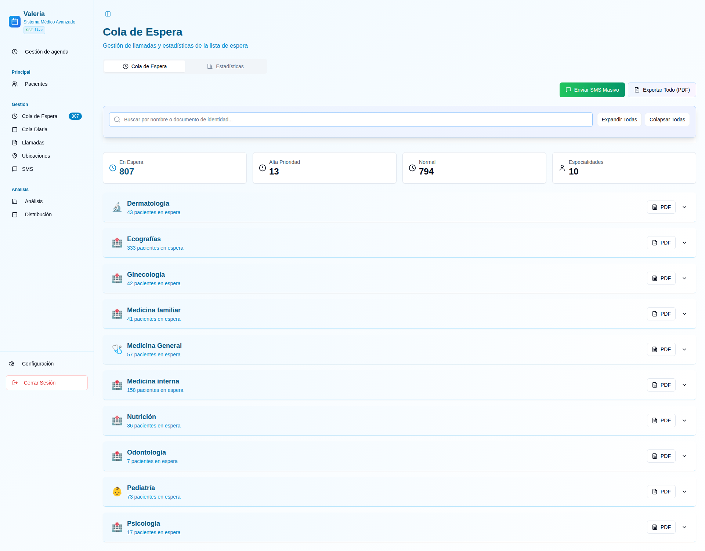
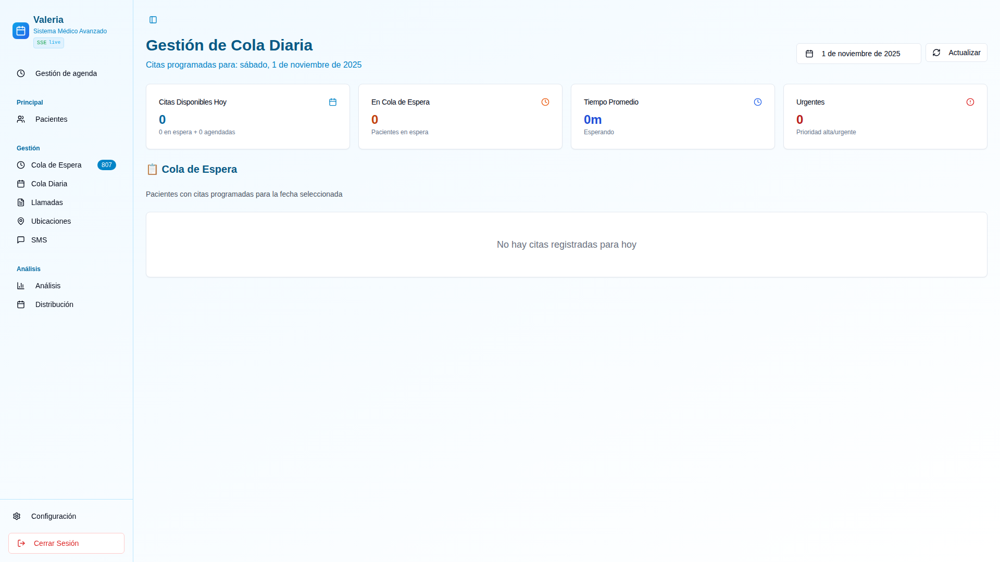

# Manual de Uso — Sistema Biosanarcall Medical

> Generado automáticamente con Playwright. Para actualizar las capturas, ejecuta: `bash scripts/manual/run_manual_fixed.sh`

## Resumen

Este manual documenta las características principales del sistema de gestión médica Biosanarcall: gestión de agendas, cola de espera, cola diaria, pacientes, llamadas, ubicaciones, gestión de SMS y análisis estadístico. Incluye capturas de pantalla generadas automáticamente.

**Credenciales demo** (solo ambiente de desarrollo):
- Usuario: `demo@demo.com`
- Contraseña: `demo123`

---

## Índice

1. [Inicio / Dashboard](#inicio--dashboard)
2. [Cola de Espera](#cola-de-espera)
3. [Cola Diaria](#cola-diaria)
4. [Pacientes](#pacientes)
5. [Llamadas](#llamadas)
6. [SMS](#sms)
7. [Ubicaciones](#ubicaciones)
8. [Análisis y Estadísticas](#análisis-y-estadísticas)
9. [Configuración](#configuración)
10. [Generar/Actualizar este manual](#generaractualizar-este-manual)

---

## Inicio / Dashboard


**Descripción**: 

El dashboard o página de inicio muestra un resumen general del sistema con:

- **Estadísticas principales**: Total de pacientes, citas programadas, citas del día y pacientes en espera.
- **Accesos rápidos**: Tarjetas con enlaces directos a las funcionalidades más utilizadas (agendar cita, gestionar pacientes, ver cola de espera).
- **Navegación lateral**: Menú colapsable con acceso a todos los módulos del sistema.
- **Indicadores visuales**: Gráficos y métricas en tiempo real del flujo de pacientes.

**Funcionalidades clave**:
- Vista rápida del estado operativo del sistema
- Navegación directa a módulos principales
- Acceso a perfil de usuario y cierre de sesión

---

## Cola de Espera



**Descripción**:

La vista de Cola de Espera es el núcleo del sistema de gestión de pacientes pendientes. Permite visualizar y gestionar todos los pacientes que esperan una asignación de cita.

**Características principales**:

- **Vista por especialidad**: Los pacientes se agrupan en acordeones por especialidad médica (Medicina General, Odontología, etc.)
- **Información del paciente**: Cada tarjeta muestra:
  - Nombre completo y documento de identidad
  - Prioridad (Alta, Normal, Baja) con código de colores
  - Teléfono de contacto
  - Tiempo en lista de espera
  - Posición en la cola
  
- **Acciones disponibles**:
  - **Llamar**: Inicia una llamada automática al paciente
  - **Asignar cita**: Abre el modal de agendamiento directo
  - **Cambiar prioridad**: Ajusta la urgencia del caso
  - **Eliminar**: Retira al paciente de la lista de espera
  
- **Búsqueda y filtros**: Buscar pacientes por nombre, documento o especialidad
- **Envío masivo de SMS**: Notificación automática a múltiples pacientes
- **Estadísticas**: Panel con métricas de la cola (total en espera, por canal, tendencias)
- **Exportar PDF**: Genera reporte imprimible de la lista completa

**Flujo de trabajo típico**:
1. Revisar pacientes en espera por especialidad
2. Verificar prioridad y tiempo de espera
3. Llamar al paciente para confirmar disponibilidad
4. Asignar cita desde el modal de agendamiento
5. El paciente pasa de "en espera" a "cita programada"

---

## Cola Diaria



**Descripción**:

La Cola Diaria muestra todas las citas programadas para un día específico, organizadas por especialidad y estado.

**Características**:

- **Selector de fecha**: Permite cambiar el día a visualizar (hoy, mañana, próxima semana)
- **Filtro por especialidad**: Visualiza solo las citas de una especialidad específica
- **Estados de citas**:
  - **Confirmada**: Paciente confirmó asistencia
  - **Pendiente**: Aún no confirmada
  - **En atención**: Paciente siendo atendido
  - **Completada**: Consulta finalizada
  - **Cancelada**: Cita cancelada
  
- **Acciones por cita**:
  - Ver detalles completos del paciente
  - Marcar como confirmada
  - Iniciar atención (cambiar estado)
  - Cancelar o reprogramar
  - Registrar consulta médica
  
- **Vista cronológica**: Las citas se ordenan por hora de inicio
- **Indicador de capacidad**: Muestra cupos ocupados vs disponibles por bloque horario

**Uso recomendado**:
- Preparación diaria: Revisar agenda del día cada mañana
- Confirmaciones: Llamar a pacientes con citas pendientes
- Control de flujo: Monitorear estados durante el día
- Gestión de imprevistos: Reasignar citas canceladas rápidamente

---

## Pacientes


**Descripción**:

El módulo de Pacientes es la base de datos central del sistema. Permite gestionar toda la información de los pacientes registrados.

**Funcionalidades**:

- **Lista completa**: Todos los pacientes registrados con paginación
- **Búsqueda avanzada**: Por nombre, documento, teléfono o EPS
- **Registro de pacientes**: Formulario modular con 6 secciones:
  1. **Información básica**: Nombre, documento, fecha de nacimiento, género
  2. **Contacto**: Teléfono, email, dirección, municipio
  3. **Información médica**: Tipo de sangre, alergias, condiciones crónicas
  4. **Aseguradora**: EPS, tipo de afiliación
  5. **Datos demográficos**: Educación, estado civil, ocupación
  6. **Notas adicionales**: Observaciones especiales

- **Edición de datos**: Actualizar información existente por secciones
- **Historial**: Ver todas las citas y consultas previas del paciente
- **Gestión de duplicados**: Detectar y fusionar registros duplicados
- **Exportación**: Descargar listados en Excel o PDF

**Validaciones incluidas**:
- Formato de documento de identidad
- Validación de email y teléfono
- Verificación de duplicados antes de guardar
- Campos obligatorios resaltados

---

## Llamadas


**Descripción**:

El módulo de Llamadas integra el sistema de telefonía (ElevenLabs/Zadarma) con la gestión de pacientes.

**Características principales**:

- **Historial de llamadas**: Registro completo de todas las llamadas realizadas
  - Fecha y hora
  - Paciente contactado
  - Duración
  - Estado (contestada, no contestada, ocupado, fuera de servicio)
  - Agente que realizó la llamada
  
- **Llamadas automáticas**: El sistema puede iniciar llamadas desde:
  - Cola de espera
  - Cola diaria
  - Módulo de pacientes
  
- **Integración con IA**: Llamadas automatizadas con voz sintética para:
  - Recordatorios de citas
  - Confirmaciones
  - Encuestas de satisfacción post-consulta
  
- **Grabaciones** (si está habilitado): Reproducir llamadas grabadas
- **Estadísticas de llamadas**: Tasa de contacto, duración promedio, mejores horarios

**Flujo de llamada automática**:
1. Sistema marca al número del paciente
2. Si contesta, reproduce mensaje pregrabado o conecta con agente
3. Registra resultado de la llamada
4. Actualiza estado del paciente (confirmado, reprogramar, etc.)

---

## SMS


**Descripción**:

El módulo de SMS permite enviar notificaciones masivas o individuales a pacientes mediante integración con LabsMobile.

**Funcionalidades**:

- **Envío masivo desde cola de espera**:
  - Seleccionar rango de pacientes (posiciones desde/hasta)
  - Excluir por EPS
  - Vista previa del número de SMS a enviar
  - Plantillas predefinidas
  
- **Plantillas personalizables**:
  - Recordatorio de cita (incluye fecha, hora, sede)
  - Confirmación de agendamiento
  - Cancelación de cita
  - Encuesta de satisfacción
  - Mensajes personalizados
  
- **Variables dinámicas** en plantillas:
  - `{nombre}` - Nombre del paciente
  - `{fecha}` - Fecha de la cita
  - `{hora}` - Hora de la cita
  - `{sede}` - Nombre de la ubicación
  - `{especialidad}` - Especialidad médica
  - `{doctor}` - Nombre del médico
  
- **Envío por lotes**: Para evitar timeouts, envíos masivos se procesan en bloques de 50 SMS
- **Historial de envíos**: Registro de todos los SMS enviados con estado de entrega
- **Balance de créditos**: Indicador de SMS disponibles en la cuenta

**Mejores prácticas**:
- Enviar recordatorios 24-48 horas antes de la cita
- Usar plantillas claras y concisas (máx 160 caracteres)
- Verificar números de teléfono antes de envíos masivos
- No enviar SMS fuera de horario laboral (8am-6pm)

---

## Ubicaciones


**Descripción**:

Gestión de sedes o ubicaciones físicas donde se prestan los servicios médicos.

**Características**:

- **Lista de sedes**: Todas las ubicaciones activas del sistema
- **Información por sede**:
  - Nombre de la ubicación
  - Dirección completa
  - Municipio/ciudad
  - Teléfono de contacto
  - Horarios de atención
  - Especialidades disponibles
  
- **Agregar nueva sede**: Formulario con datos de ubicación y configuración
- **Editar/Desactivar**: Modificar información o desactivar sedes temporalmente
- **Asignación de agenda**: Configurar qué médicos y especialidades operan en cada sede
- **Capacidad**: Definir cupos diarios por sede y especialidad

**Uso en el sistema**:
- Al agendar una cita, se selecciona la sede más conveniente para el paciente
- Las agendas se generan por sede y especialidad
- Los reportes pueden filtrarse por ubicación

---

## Análisis y Estadísticas


**Descripción**:

Panel de control con métricas y análisis del desempeño operativo del sistema.

**Métricas disponibles**:

1. **Tendencia diaria**:
   - Gráfico de líneas con citas programadas por día
   - Comparativa semanal/mensual
   - Picos de demanda identificados
   
2. **Distribución por canal**:
   - Citas por origen: Teléfono, WhatsApp, Presencial, Web
   - Gráfico de barras o pie chart
   - Permite identificar canales más efectivos
   
3. **Estadísticas por especialidad y EPS**:
   - Cruce de datos entre especialidad médica y aseguradora
   - Gráficos agrupados
   - Filtros dinámicos por fecha
   
4. **Métricas de cola de espera**:
   - Tiempo promedio de espera
   - Tasa de conversión (espera → cita asignada)
   - Distribución de prioridades
   
5. **Indicadores clave (KPIs)**:
   - Total de citas del mes
   - Tasa de cancelación
   - Tasa de asistencia (show-up rate)
   - Satisfacción del paciente (si hay encuestas)

**Filtros disponibles**:
- Rango de fechas personalizado
- Por especialidad
- Por sede
- Por médico
- Por estado de cita

**Exportación**: Todos los gráficos y tablas pueden exportarse a Excel o PDF para reportes gerenciales.

---

## Configuración


**Descripción**:

El módulo de Configuración permite administrar parámetros generales del sistema y gestión de usuarios.

**Secciones**:

1. **Variables del sistema**:
   - Días de archivo de llamadas (`CALL_ARCHIVE_DAYS`)
   - Activación de búsqueda full-text
   - Cache de búsqueda de pacientes
   - URLs de integraciones externas
   
2. **Integración SMS**:
   - Configuración de LabsMobile (API key, usuario)
   - Balance de créditos
   - Plantillas predeterminadas
   
3. **Integración de llamadas**:
   - Configuración ElevenLabs (voz sintética)
   - Zadarma (telefonía VoIP)
   - Números de origen
   
4. **Gestión de usuarios**:
   - Crear/editar usuarios del sistema
   - Asignar roles (Administrador, Agente, Doctor)
   - Resetear contraseñas
   - Activar/desactivar cuentas
   
5. **Gestión de médicos**:
   - Alta de médicos en el sistema
   - Asignación de especialidades
   - Configuración de acceso al portal de doctores
   - Reseteo de contraseñas médicas
   
6. **Configuración de horarios**:
   - Días laborables
   - Horarios de atención por sede
   - Duración estándar de citas (15 min por defecto)
   
7. **Respaldos y mantenimiento**:
   - Programación de backups automáticos
   - Logs del sistema
   - Limpieza de datos antiguos

**Seguridad**:
- Solo usuarios con rol Administrador pueden acceder a Configuración
- Cambios críticos requieren confirmación
- Logs de auditoría registran todas las modificaciones

---

## Generar/Actualizar este manual

Este manual se genera automáticamente usando Playwright, que navega por la aplicación en **producción**, toma capturas de pantalla y las guarda en `docs/manual_screenshots/`.

### Configuración

El sistema está preparado para trabajar con tu **frontend en producción**:
- Frontend servido desde `frontend/dist/` por Nginx
- URL: `https://biosanarcall.site`
- No requiere levantar dev server

### Requisitos

1. **Frontend en producción disponible**:
   - Nginx sirviendo el frontend: `sudo systemctl status nginx`
   - Si está caído: `sudo systemctl start nginx`

2. **Credenciales demo**: Usuario `demo@demo.com` con contraseña `demo123` debe existir en la base de datos.

3. **Node.js 18+** instalado.

### Ejecutar generador

**Opción 1: Usar producción** (por defecto - recomendado):

```bash
# Desde la raíz del repositorio
bash scripts/manual/run_manual_fixed.sh
```

**Opción 2: Usar dev local** (si necesitas probar cambios):

```bash
# Terminal 1: Levantar frontend
cd frontend
npm run dev

# Terminal 2: Generar manual apuntando a local
BASE_URL=http://localhost:8080 bash scripts/manual/run_manual_fixed.sh
```

El script:
- Verifica que el frontend esté disponible (producción o local según BASE_URL)
- Instala Playwright y navegadores automáticamente (primera vez)
- Se autentica con las credenciales demo
- Navega por las páginas principales: Dashboard, Cola, Pacientes, etc.
- Captura screenshots full-page en `docs/manual_screenshots/`
- Toma aproximadamente 1-2 minutos

### Personalización

```bash
# Usar staging u otro ambiente
BASE_URL=https://staging.biosanarcall.site bash scripts/manual/run_manual_fixed.sh

# Usar credenciales diferentes
MANUAL_EMAIL=admin@test.com MANUAL_PASSWORD=pass123 bash scripts/manual/run_manual_fixed.sh
```

### Troubleshooting

Ver documentación completa en `scripts/manual/README.md`.

**Problemas comunes**:

- **Connection refused (producción)**: 
  - Verifica Nginx: `sudo systemctl status nginx`
  - Verifica que `frontend/dist/` tenga archivos
  - Si está vacío: `cd frontend && npm run build`
  
- **Connection refused (desarrollo)**: 
  - Asegúrate de que el frontend esté corriendo: `cd frontend && npm run dev`
  
- **Login failed**: 
  - Verifica que las credenciales demo existan
  - Prueba: `cd backend && npm run db:seed`
  
- **Capturas en blanco**: 
  - Aumenta los timeouts en `generate_manual.js`
  - Ejecuta en modo visible (headless: false) para debug

### Actualizar frontend antes de generar

Si has hecho cambios recientes al frontend:

```bash
cd frontend
npm run build
# Los archivos se actualizan en dist/
# Nginx los sirve automáticamente
```

### Actualizar descripciones

Después de generar las capturas, puedes editar este archivo (`docs/MANUAL_DE_USO.md`) para:
- Añadir más detalles en las descripciones de cada sección
- Incluir casos de uso específicos
- Documentar nuevas funcionalidades
- Añadir FAQs o tips de uso

---

## Soporte

Para reportar problemas o sugerencias sobre este manual, contacta al equipo de desarrollo o abre un issue en el repositorio.

**Última actualización**: Generado automáticamente - Revisa la fecha de las capturas en `docs/manual_screenshots/`
