# Sistema de Lista de Espera para Citas Médicas - Biosanarcall

## 📋 Resumen Ejecutivo

El **Sistema de Lista de Espera** permite gestionar automáticamente las solicitudes de citas cuando no hay cupos disponibles. Cuando un paciente intenta agendar una cita y no hay disponibilidad, en lugar de rechazar la solicitud, el sistema la almacena en una **lista de espera ordenada por prioridad** y la reasigna automáticamente cuando se liberan cupos.

---

## 🎯 Características Principales

### ✅ Funcionalidades Implementadas

1. **Almacenamiento Inteligente**: 
   - Citas solicitadas sin cupos se guardan en `appointments_waiting_list`
   - No se pierde ninguna solicitud de paciente
   - Priorización automática (Urgente > Alta > Normal > Baja)

2. **Reasignación Automática**:
   - Trigger que detecta cancelaciones de citas
   - Reasigna automáticamente desde lista de espera
   - Procedimiento almacenado `process_waiting_list_for_availability`

3. **Visibilidad Completa**:
   - Campo `waiting_list_count` en todas las disponibilidades
   - Consulta detallada de lista de espera con posición en cola
   - Estadísticas de solicitudes pendientes

4. **Control Manual**:
   - Herramienta `reassignWaitingListAppointments` para procesar manualmente
   - Filtros avanzados para consultar lista de espera

---

## 🗂️ Estructura de Base de Datos

### Tabla: `appointments_waiting_list`

```sql
CREATE TABLE appointments_waiting_list (
  id                        BIGINT(20) UNSIGNED AUTO_INCREMENT PRIMARY KEY,
  patient_id                BIGINT(20) UNSIGNED NOT NULL,
  availability_id           BIGINT(20) UNSIGNED NOT NULL,
  scheduled_date            DATETIME NOT NULL,
  appointment_type          ENUM('Presencial', 'Telemedicina') DEFAULT 'Presencial',
  reason                    TEXT NOT NULL,
  notes                     TEXT NULL,
  priority_level            ENUM('Baja', 'Normal', 'Alta', 'Urgente') DEFAULT 'Normal',
  created_at                TIMESTAMP DEFAULT CURRENT_TIMESTAMP,
  updated_at                TIMESTAMP DEFAULT CURRENT_TIMESTAMP ON UPDATE CURRENT_TIMESTAMP,
  requested_by              VARCHAR(100) NULL,
  status                    ENUM('pending', 'reassigned', 'cancelled', 'expired') DEFAULT 'pending',
  reassigned_at             TIMESTAMP NULL,
  reassigned_appointment_id BIGINT(20) UNSIGNED NULL,
  cancelled_reason          TEXT NULL,
  expires_at                DATETIME NULL,
  
  FOREIGN KEY (patient_id) REFERENCES patients(id) ON DELETE CASCADE,
  FOREIGN KEY (availability_id) REFERENCES availabilities(id) ON DELETE CASCADE,
  FOREIGN KEY (reassigned_appointment_id) REFERENCES appointments(id) ON DELETE SET NULL
);
```

**16 campos** | **3 Foreign Keys** | **7 Índices** | **Engine: InnoDB**

---

### Vista: `waiting_list_with_details`

Vista enriquecida con información completa:
- Datos del paciente (nombre, documento, teléfono, email)
- Información de disponibilidad (fecha, hora, doctor, especialidad)
- Cupos actuales disponibles
- Posición en la cola de espera
- Días hasta expiración

```sql
SELECT * FROM waiting_list_with_details WHERE status = 'pending' ORDER BY priority_level, created_at;
```

---

### Procedimiento: `process_waiting_list_for_availability`

**Propósito**: Reasignar automáticamente solicitudes de lista de espera cuando hay cupos disponibles.

**Parámetros**:
- `p_availability_id` (BIGINT): ID de la disponibilidad a procesar

**Lógica**:
1. Calcula cupos disponibles actuales
2. Consulta lista de espera ordenada por prioridad y antigüedad
3. Por cada solicitud pendiente (mientras haya cupos):
   - Crea cita en `appointments`
   - Marca solicitud como `reassigned` en `appointments_waiting_list`
   - Decrementa contador de cupos disponibles

**Llamada manual**:
```sql
CALL process_waiting_list_for_availability(132);
```

---

### Trigger: `auto_process_waiting_list_on_cancel`

**Evento**: AFTER UPDATE en `appointments`

**Condición**: Cuando una cita cambia de estado `Pendiente/Confirmada` → `Cancelada`

**Acción**: Llama automáticamente a `process_waiting_list_for_availability`

```sql
-- Se ejecuta automáticamente al cancelar una cita
UPDATE appointments SET status = 'Cancelada' WHERE id = 123;
-- El trigger reasigna automáticamente desde lista de espera
```

---

## 🛠️ Herramientas MCP

### 1. `getAvailableAppointments` (Actualizada)

**Descripción**: Lista citas disponibles con información de lista de espera.

**Cambios**:
- ✅ Campo nuevo: `waiting_list_count` en cada disponibilidad
- ✅ Campo nuevo: `total_waiting_list` en agrupación por doctor

**Ejemplo de uso**:
```json
{
  "method": "tools/call",
  "params": {
    "name": "getAvailableAppointments",
    "arguments": {
      "doctor_id": 15,
      "limit": 10
    }
  }
}
```

**Respuesta**:
```json
{
  "available_appointments": [
    {
      "availability_id": 132,
      "slots_available": "7",
      "waiting_list_count": 3,  // ✅ NUEVO
      "doctor": {...},
      "specialty": {...}
    }
  ],
  "grouped_by_doctor_and_specialty": [
    {
      "doctor": {...},
      "total_slots_available": "07",
      "total_waiting_list": 3,  // ✅ NUEVO
      "availabilities": [...]
    }
  ]
}
```

---

### 2. `scheduleAppointment` (Actualizada)

**Descripción**: Agenda citas o añade a lista de espera si no hay cupos.

**Comportamiento**:
- **CON cupos disponibles**: Agenda en `appointments` (comportamiento normal)
- **SIN cupos disponibles**: Guarda en `appointments_waiting_list`

**Ejemplo sin cupos**:
```json
{
  "method": "tools/call",
  "params": {
    "name": "scheduleAppointment",
    "arguments": {
      "patient_id": 1042,
      "availability_id": 132,
      "scheduled_date": "2025-10-10 09:00:00",
      "appointment_type": "Presencial",
      "reason": "Consulta dermatológica",
      "priority_level": "Alta"
    }
  }
}
```

**Respuesta (sin cupos)**:
```json
{
  "success": true,
  "waiting_list": true,  // ✅ Indica que fue a lista de espera
  "message": "No hay cupos disponibles. La solicitud fue agregada a la lista de espera",
  "waiting_list_id": 123,
  "queue_position": 4,  // Posición en la cola
  "patient": {...},
  "requested_appointment": {...},
  "info": "Usted es el número 4 en la lista de espera. Será notificado cuando haya un cupo disponible."
}
```

---

### 3. `getWaitingListAppointments` (Nueva)

**Descripción**: Consulta solicitudes en lista de espera con filtros avanzados.

**Parámetros**:
- `patient_id` (opcional): Filtrar por paciente
- `doctor_id` (opcional): Filtrar por médico
- `specialty_id` (opcional): Filtrar por especialidad
- `location_id` (opcional): Filtrar por sede
- `priority_level` (opcional): 'Baja', 'Normal', 'Alta', 'Urgente', 'Todas'
- `status` (opcional): 'pending', 'reassigned', 'cancelled', 'expired', 'all'
- `limit` (default: 50): Máximo de resultados

**Ejemplo**:
```json
{
  "method": "tools/call",
  "params": {
    "name": "getWaitingListAppointments",
    "arguments": {
      "doctor_id": 15,
      "priority_level": "Urgente",
      "status": "pending",
      "limit": 20
    }
  }
}
```

**Respuesta**:
```json
{
  "success": true,
  "count": 3,
  "waiting_list": [
    {
      "waiting_list_id": 456,
      "queue_position": 1,  // Posición en la cola
      "priority_level": "Urgente",
      "days_waiting": 2,    // Días esperando
      "patient": {
        "id": 1042,
        "name": "Juan Pérez",
        "phone": "3001234567"
      },
      "availability": {
        "id": 132,
        "date": "2025-10-10",
        "time_range": "08:00 - 12:00",
        "slots_currently_available": 0,  // Cupos actuales
        "can_be_reassigned": false       // ¿Puede reasignarse ahora?
      },
      "doctor": {...},
      "specialty": {...}
    }
  ],
  "statistics": {
    "total_waiting": 3,
    "by_priority": {
      "urgente": 1,
      "alta": 2,
      "normal": 0,
      "baja": 0
    },
    "can_be_reassigned_now": 0
  }
}
```

---

### 4. `reassignWaitingListAppointments` (Nueva)

**Descripción**: Procesa manualmente lista de espera para una disponibilidad.

**Parámetros**:
- `availability_id` (requerido): ID de la disponibilidad

**Ejemplo**:
```json
{
  "method": "tools/call",
  "params": {
    "name": "reassignWaitingListAppointments",
    "arguments": {
      "availability_id": 132
    }
  }
}
```

**Respuesta**:
```json
{
  "success": true,
  "message": "Se procesó la lista de espera exitosamente",
  "reassigned_count": 2,       // Citas reasignadas
  "still_waiting_count": 1,    // Aún esperando
  "availability_info": {
    "availability_id": 132,
    "date": "2025-10-10",
    "doctor": "Dr. Erwin Vargas",
    "specialty": "Dermatología",
    "capacity": 10,
    "appointments_before": 8,
    "appointments_after": 10,   // Ahora lleno
    "slots_available_before": 2,
    "slots_available_after": 0
  },
  "info": "Se reasignaron 2 solicitudes de la lista de espera a citas confirmadas"
}
```

---

## 🔄 Flujo de Trabajo

### Escenario 1: Agendamiento Normal (con cupos)


### Escenario 2: Lista de Espera (sin cupos)


### Escenario 3: Reasignación Automática

```mermaid
graph TD
A[Cita cancelada] --> B[Trigger detecta cancelación]
B --> C[CALL process_waiting_list_for_availability]
C --> D{¿Hay solicitudes pendientes?}
D -->|SÍ| E[Reasignar por prioridad]
E --> F[INSERT en appointments]
F --> G[UPDATE en waiting_list: status='reassigned']
G --> H[Notificación al paciente]
D -->|NO| I[Fin]
```



### Escenario 4: Reasignación Manual

```mermaid
graph TD
A[Administrador] --> B[reassignWaitingListAppointments]
B --> C[CALL process_waiting_list_for_availability]
C --> D{¿Hay cupos y solicitudes?}
D -->|SÍ| E[Reasignar todas las posibles]
E --> F[Retornar contador de reasignaciones]
D -->|NO| G[Retornar 0 reasignaciones]
```



---

## 📊 Priorización

### Orden de Reasignación

1. **Urgente** (prioridad 1)
2. **Alta** (prioridad 2)
3. **Normal** (prioridad 3)
4. **Baja** (prioridad 4)

Dentro de cada nivel de prioridad: **FIFO (First In, First Out)** por `created_at`.

### Ejemplo de Cola

| Posición | Paciente   | Prioridad | Fecha Solicitud | Días Esperando |
|----------|------------|-----------|-----------------|----------------|
| 1        | Juan       | Urgente   | 2025-10-01     | 2              |
| 2        | María      | Alta      | 2025-09-30     | 3              |
| 3        | Pedro      | Alta      | 2025-10-02     | 1              |
| 4        | Ana        | Normal    | 2025-09-28     | 5              |

---

## 🧪 Testing

### Script de Prueba: `test-waiting-list-system.sh`

Ubicación: `/home/ubuntu/app/mcp-server-node/test-waiting-list-system.sh`

**Tests incluidos**:

1. ✅ **TEST 1**: Verificar campo `waiting_list_count` en `getAvailableAppointments`
2. ✅ **TEST 2**: Agendar cita con cupos disponibles o sin cupos (lista de espera)
3. ✅ **TEST 3**: Consultar lista de espera con `getWaitingListAppointments`
4. ✅ **TEST 4**: Ejecutar reasignación manual con `reassignWaitingListAppointments`
5. ✅ **TEST 5**: Verificar actualización de contadores

**Ejecución**:
```bash
/home/ubuntu/app/mcp-server-node/test-waiting-list-system.sh
```

**Resultado esperado**: ✅ Todos los tests PASSED

---

## 📈 Estadísticas y Monitoreo

### Consulta: Solicitudes por Prioridad

```sql
SELECT 
  priority_level,
  COUNT(*) as total,
  MIN(created_at) as oldest_request,
  AVG(DATEDIFF(NOW(), created_at)) as avg_days_waiting
FROM appointments_waiting_list
WHERE status = 'pending'
GROUP BY priority_level
ORDER BY 
  CASE priority_level
    WHEN 'Urgente' THEN 1
    WHEN 'Alta' THEN 2
    WHEN 'Normal' THEN 3
    WHEN 'Baja' THEN 4
  END;
```

### Consulta: Disponibilidades con Más Solicitudes

```sql
SELECT 
  a.id AS availability_id,
  a.date,
  d.name AS doctor_name,
  s.name AS specialty_name,
  COUNT(wl.id) AS waiting_count,
  a.capacity,
  (SELECT COUNT(*) FROM appointments WHERE availability_id = a.id AND status IN ('Pendiente','Confirmada')) AS current_appointments
FROM availabilities a
INNER JOIN doctors d ON a.doctor_id = d.id
INNER JOIN specialties s ON a.specialty_id = s.id
LEFT JOIN appointments_waiting_list wl ON wl.availability_id = a.id AND wl.status = 'pending'
GROUP BY a.id
HAVING waiting_count > 0
ORDER BY waiting_count DESC;
```

---

## 🔧 Mantenimiento

### Limpiar Solicitudes Expiradas

```sql
-- Marcar como expiradas las solicitudes de más de 30 días
UPDATE appointments_waiting_list
SET status = 'expired'
WHERE status = 'pending'
  AND DATEDIFF(NOW(), created_at) > 30;
```

### Reiniciar PM2 (MCP Server)

```bash
cd /home/ubuntu/app/mcp-server-node
npm run build
pm2 restart mcp-unified
```

### Verificar Estado

```bash
pm2 list
pm2 logs mcp-unified --lines 50
```

---

## 🚀 Integración con ElevenLabs

El sistema de lista de espera está completamente integrado con el endpoint MCP de ElevenLabs:

**Endpoint**: `https://biosanarcall.site/mcp/`

**Herramientas disponibles**: 7 tools (antes 5)

```bash
curl -s -X POST https://biosanarcall.site/mcp/ \
  -H "Content-Type: application/json" \
  -d '{"jsonrpc": "2.0", "id": 1, "method": "tools/list"}' \
  | jq -r '.result.tools[] | .name'
```

**Salida**:
```
getAvailableAppointments
getPatientAppointments
getWaitingListAppointments        ← NUEVA
listActiveEPS
reassignWaitingListAppointments   ← NUEVA
registerPatientSimple
scheduleAppointment
```

---

## 📝 Resumen de Cambios

### Base de Datos
- ✅ Tabla `appointments_waiting_list` (16 campos, 3 FK)
- ✅ Vista `waiting_list_with_details`
- ✅ Procedimiento `process_waiting_list_for_availability`
- ✅ Trigger `auto_process_waiting_list_on_cancel`
- ✅ 7 índices para optimización

### Código TypeScript
- ✅ `getAvailableAppointments`: Agregado `waiting_list_count`
- ✅ `scheduleAppointment`: Lógica de lista de espera
- ✅ `getWaitingListAppointments`: Nueva herramienta (270 líneas)
- ✅ `reassignWaitingListAppointments`: Nueva herramienta (110 líneas)

### Testing
- ✅ Script `test-waiting-list-system.sh` (200+ líneas)
- ✅ 5 tests automatizados
- ✅ Todos los tests PASSED ✅

### Deployment
- ✅ Compilación TypeScript exitosa
- ✅ PM2 reiniciado con nuevas herramientas
- ✅ Endpoint MCP funcionando en producción

---

## 👥 Soporte

**Desarrollado por**: Sistema MCP Biosanarcall  
**Fecha**: Octubre 2, 2025  
**Versión**: 1.0.0  
**Herramientas MCP**: 7 disponibles  
**Estado**: ✅ Producción

---

## 📄 Licencia

Propietario: Biosanarcall Medical System  
Todos los derechos reservados.
