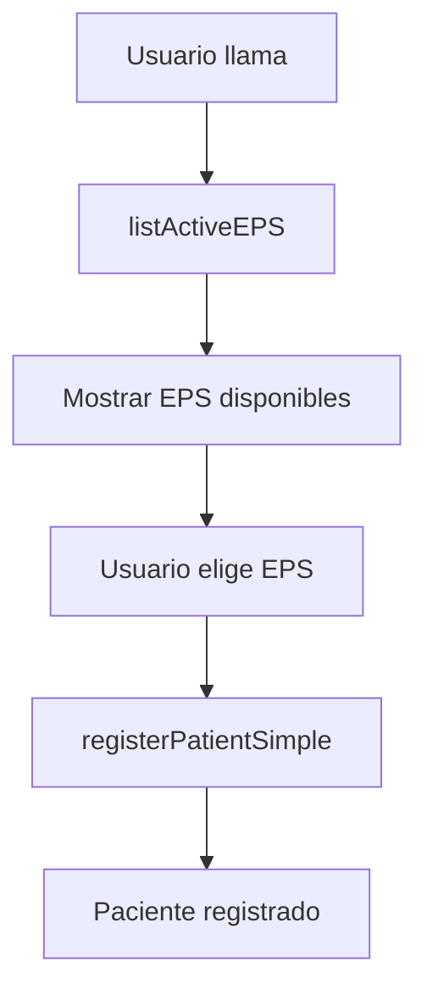
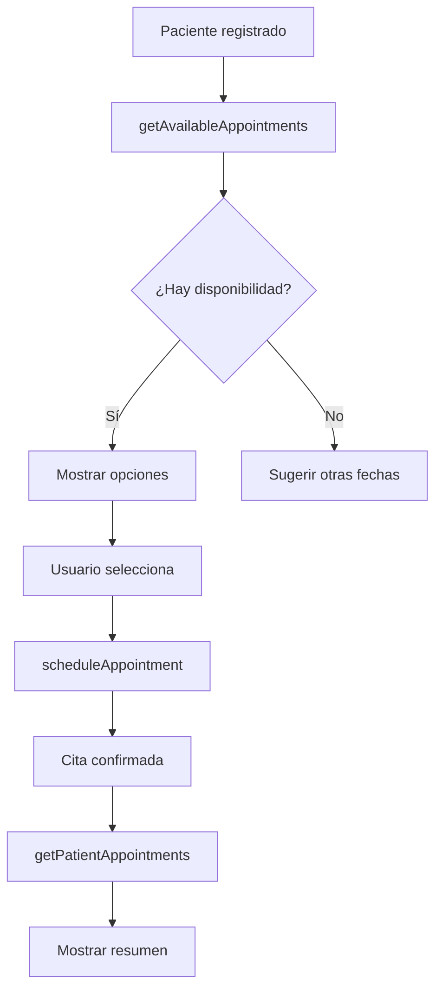
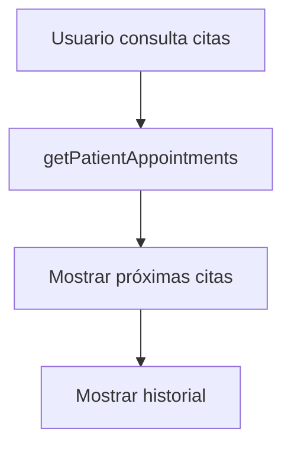

# 🏥 Sistema Completo de Gestión de Citas Médicas MCP

## 📊 Descripción General

Sistema MCP (Model Context Protocol) completo para gestión de pacientes y citas médicas con **5 herramientas** integradas, compatible con ElevenLabs Agent Studio y otros clientes MCP.

**Versión:** 3.0.0  
**Fecha:** Octubre 1, 2025  
**Estado:** ✅ Completamente funcional y probado  
**Última actualización:** Sistema de agregación de cupos corregido (GROUP BY)  
**Corrección crítica:** getAvailableAppointments ahora suma correctamente todos los cupos distribuidos

---

## 🛠️ Herramientas Disponibles

### Categoría 1: Gestión de EPS y Pacientes

#### 1️⃣ `listActiveEPS`
Consulta las EPS (Entidades Promotoras de Salud) activas disponibles en el sistema.

**Entrada:** Ninguna

**Salida:**
```json
{
  "success": true,
  "count": 10,
  "eps_list": [
    {
      "id": 9,
      "name": "COOMEVA",
      "code": "2721",
      "has_agreement": true,
      "agreement_date": null,
      "notes": "Activa",
      "created_at": "2025-08-11T12:42:09.000Z"
    }
  ],
  "message": "Se encontraron 10 EPS activas disponibles",
  "usage_note": "Use el campo 'id' para registrar pacientes"
}
```

---

#### 2️⃣ `registerPatientSimple`
Registro simplificado de pacientes con validación de EPS.

**Entrada:**
```json
{
  "document": "1234567890",
  "name": "Juan Pérez García",
  "phone": "3101234567",
  "insurance_eps_id": 14,
  "notes": "Primera consulta" // Opcional
}
```

**Salida:**
```json
{
  "success": true,
  "message": "Paciente registrado exitosamente",
  "patient_id": 1038,
  "patient": {
    "id": 1038,
    "document": "1234567890",
    "name": "Juan Pérez García",
    "phone": "3101234567",
    "eps": "NUEVA EPS",
    "eps_code": "2715",
    "status": "Activo",
    "created_at": "2025-10-01T15:50:00.000Z"
  }
}
```

---

### Categoría 2: Sistema de Citas Médicas

#### 3️⃣ `getAvailableAppointments`
Lista todas las citas médicas disponibles. Permite filtrar por médico, especialidad y ubicación.

**Entrada:**
```json
{
  "doctor_id": 6,                // Opcional: Filtrar por médico específico
  "specialty_id": 1,             // Opcional: Filtrar por especialidad
  "location_id": 1,              // Opcional: Filtrar por sede
  "limit": 50                    // Opcional: Número máximo de resultados (default: 50)
}
```

**Nota:** Todos los parámetros son opcionales. Sin filtros, retorna todas las disponibilidades futuras.

**Salida:**
```json
{
  "success": true,
  "message": "Se encontraron 1 disponibilidades",
  "count": 1,
  "total_dates": 1,
  "available_appointments": [
    {
      "availability_id": 131,
      "appointment_date": "2025-10-15T00:00:00.000Z",
      "time_range": "08:00 - 12:00",
      "duration_minutes": 30,
      "total_capacity": 30,
      "slots_available": "28",
      "total_quota_distributed": "30",
      "total_assigned": "2",
      "distribution_count": 11,
      "doctor": {
        "id": 6,
        "name": "Dra. Ana Teresa Escobar",
        "email": "lider.callcenterbiossanar@gmail.com",
        "phone": "3142564784"
      },
      "specialty": {
        "id": 1,
        "name": "Medicina General"
      },
      "location": {
        "id": 1,
        "name": "Sede biosanar san gil",
        "address": "Cra. 9 #10-29, San Gil, Santander",
        "phone": " 6076911308"
      }
    }
  ],
  "filters_applied": {
    "doctor_id": "Ninguno",
    "specialty_id": "Ninguno",
    "location_id": "Ninguno",
    "limit": 50
  },
  "info": {
    "appointment_date_info": "appointment_date es la fecha de la cita médica (cuando el doctor atiende)",
    "slots_available_info": "slots_available es el TOTAL de cupos disponibles sumando todas las distribuciones",
    "distribution_system": "El sistema distribuye cupos entre varios días, pero todos son para la misma fecha de cita"
  }
}
```

**Conceptos Importantes:**
- **`appointment_date`**: Fecha de la cita médica (2025-10-15 - cuando el doctor atenderá)
- **`total_capacity`**: Capacidad total configurada en la availability
- **`total_quota_distributed`**: Total de cupos distribuidos entre todos los días
- **`total_assigned`**: Total de cupos ya asignados a pacientes
- **`slots_available`**: **CUPOS DISPONIBLES TOTALES** (suma de todas las distribuciones)
- **`distribution_count`**: Número de días en que se distribuyeron cupos
- **Resultado**: 1 availability por fecha, con el total de cupos sumados
- Retorna solo citas futuras (>= fecha actual)
- Ordenado por fecha, hora de inicio y nombre de especialidad

**Ejemplo Real:**
- Doctor tiene agenda para el **15 de octubre 2025**
- Capacidad total: **30 cupos**
- Sistema distribuyó en **11 días** (Oct 1, 2, 3, 6, 7, 8, 9, 10, 13, 14, 15)
- Ya se asignaron: **2 cupos**
- **Disponibles: 28 cupos** ← Este es el número que ve el paciente

**Validaciones:**
- ✅ Solo muestra disponibilidades futuras (date >= hoy)
- ✅ Solo muestra disponibilidades activas
- ✅ Solo muestra cupos disponibles (assigned < quota)
- ✅ Incluye información completa de doctor, especialidad y sede
- ✅ Permite filtrar por doctor_id, specialty_id y location_id
- ✅ Ordenado por fecha, hora y especialidad
- ✅ Límite configurable de resultados (default: 50)

---

#### 4️⃣ `scheduleAppointment`
Asigna una cita médica a un paciente con validaciones automáticas.

**Entrada:**
```json
{
  "patient_id": 1038,                      // Requerido: ID del paciente
  "availability_id": 131,                   // Requerido: ID de disponibilidad
  "scheduled_date": "2025-10-15 09:00:00", // Requerido: YYYY-MM-DD HH:MM:SS (fecha de la cita)
  "appointment_type": "Presencial",         // Opcional: "Presencial" o "Telemedicina"
  "reason": "Consulta de control",          // Opcional: Motivo de la cita
  "notes": "Primera cita",                  // Opcional: Notas adicionales
  "priority_level": "Normal"                // Opcional: "Baja", "Normal", "Alta", "Urgente"
}
```

**Salida Exitosa:**
```json
{
  "success": true,
  "message": "Cita agendada exitosamente",
  "appointment_id": 120,
  "appointment": {
    "id": 120,
    "patient": {
      "id": 1038,
      "name": "Paciente Test Citas MCP",
      "document": "TEST75234"
    },
    "scheduled_at": "2025-10-15 09:00:00",
    "appointment_date": "2025-10-15",
    "duration_minutes": 30,
    "appointment_type": "Presencial",
    "status": "Confirmada",
    "doctor": {
      "id": 6,
      "name": "Dra. Ana Teresa Escobar"
    },
    "specialty": {
      "id": 1,
      "name": "Medicina General"
    },
    "location": {
      "id": 1,
      "name": "Sede biosanar san gil"
    },
    "reason": "Consulta de control",
    "priority_level": "Normal"
  },
  "availability_info": {
    "distribution_date": "2025-10-01",
    "quota": 4,
    "assigned": 1,
    "remaining": 3
  },
  "info": "La cita fue registrada y el cupo actualizado exitosamente"
}
```

**Conceptos Importantes:**
- **`scheduled_at`**: Fecha y hora completa de la cita (YYYY-MM-DD HH:MM:SS)
- **`appointment_date`**: Solo la fecha de la cita médica
- **`distribution_date`**: Fecha en que se distribuyeron los cupos (en availability_info)
- El sistema actualiza automáticamente el contador `assigned` en la distribución

**Validaciones Automáticas:**
1. ✅ Paciente existe y está activo
2. ✅ Disponibilidad existe y está activa
3. ✅ La fecha de `scheduled_date` coincide con la disponibilidad del doctor
4. ✅ Hay cupos disponibles en cualquier `availability_distribution` para esa cita
5. ✅ Paciente no tiene cita duplicada en el mismo horario
6. ✅ Actualiza `assigned++` en `availability_distribution`
7. ✅ Crea registro en `appointments` con status "Confirmada"
8. ✅ Marca como origen "Sistema_Inteligente"

---

#### 5️⃣ `getPatientAppointments`
Consulta todas las citas de un paciente con resumen detallado.

**Entrada:**
```json
{
  "patient_id": 1038,     // Requerido: ID del paciente
  "status": "Confirmada"  // Opcional: Filtrar por estado
}
```

**Salida:**
```json
{
  "success": true,
  "message": "Se encontraron 1 citas",
  "count": 1,
  "summary": {
    "total": 1,
    "upcoming": 1,
    "past": 0,
    "by_status": {
      "pendiente": 0,
      "confirmada": 1,
      "completada": 0,
      "cancelada": 0
    }
  },
  "upcoming_appointments": [
    {
      "id": 120,
      "scheduled_at": "2025-10-15T09:00:00.000Z",
      "duration_minutes": 30,
      "appointment_type": "Presencial",
      "status": "Confirmada",
      "reason": "Consulta de control",
      "notes": "Primera cita",
      "priority_level": "Normal",
      "created_at": "2025-10-01T15:45:30.000Z",
      "doctor": {
        "id": 6,
        "name": "Dra. Ana Teresa Escobar"
      },
      "specialty": {
        "id": 1,
        "name": "Medicina General"
      },
      "location": {
        "id": 1,
        "name": "Sede biosanar san gil",
        "address": "Cra. 9 #10-29, San Gil, Santander",
        "phone": " 6076911308"
      }
    }
  ],
  "past_appointments": []
}
```

---

## 🔄 Flujos de Trabajo Recomendados

### Flujo 1: Registro de Paciente Nueva



**Pasos:**
1. Llamar `listActiveEPS` para obtener EPS disponibles
2. Presentar opciones al usuario
3. Recopilar datos: nombre, cédula, teléfono
4. Llamar `registerPatientSimple` con el `insurance_eps_id` seleccionado
5. Guardar `patient_id` para uso posterior

---

### Flujo 2: Agendar Cita Médica



**Pasos:**
1. Usar `getAvailableAppointments` (sin parámetros para ver todas, o con filtros)
2. Opcionalmente filtrar por `doctor_id`, `specialty_id` o `location_id`
3. Presentar opciones disponibles al usuario (doctor, fecha, horario, sede)
4. Usuario selecciona una opción
5. Llamar `scheduleAppointment` con:
   - `patient_id` del paciente
   - `availability_id` de la opción seleccionada
   - `scheduled_date` con fecha y hora específica (debe coincidir con `appointment_date`)
6. Confirmar con `getPatientAppointments` para verificar

---

### Flujo 3: Consultar Citas Existentes



**Pasos:**
1. Llamar `getPatientAppointments` con `patient_id`
2. Revisar sección `upcoming_appointments` para próximas citas
3. Revisar sección `past_appointments` para historial
4. Usar `summary` para estadísticas rápidas

---

## 📋 Estructura de Base de Datos

### 🔍 Ejemplo del Sistema de Distribución de Cupos

**Escenario Real:** Doctor tiene disponibilidad el 15 de octubre de 2025

```
┌─────────────────────────────────────────────────────────────┐
│ AVAILABILITIES (availability_id = 131)                      │
├─────────────────────────────────────────────────────────────┤
│ date: 2025-10-15  ← FECHA DE LA CITA MÉDICA                │
│ doctor: Dra. Ana Teresa Escobar                             │
│ specialty: Medicina General                                 │
│ location: Sede biosanar san gil                             │
│ time: 08:00 - 12:00                                         │
│ duration: 30 minutos                                        │
│ capacity: 30 cupos TOTALES                                  │
└─────────────────────────────────────────────────────────────┘
                              │
                              │ Sistema distribuye entre días
                              ▼
┌─────────────────────────────────────────────────────────────┐
│ AVAILABILITY_DISTRIBUTION                                   │
│ (Distribución de cupos entre múltiples días)                │
├─────────────────────────────────────────────────────────────┤
│ ID: 133 | day_date: 2025-10-01 | quota: 4 | assigned: 0    │
│ ID: 132 | day_date: 2025-10-02 | quota: 3 | assigned: 0    │
│ ID: 142 | day_date: 2025-10-03 | quota: 4 | assigned: 0    │
│ ID: 134 | day_date: 2025-10-06 | quota: 2 | assigned: 0    │
│ ID: 136 | day_date: 2025-10-07 | quota: 2 | assigned: 0    │
│ ID: 139 | day_date: 2025-10-08 | quota: 2 | assigned: 0    │
│ ID: 137 | day_date: 2025-10-09 | quota: 2 | assigned: 0    │
│ ID: 138 | day_date: 2025-10-10 | quota: 2 | assigned: 0    │
│ ID: 141 | day_date: 2025-10-13 | quota: 5 | assigned: 0    │
│ ID: 135 | day_date: 2025-10-14 | quota: 2 | assigned: 0    │
│ ID: 140 | day_date: 2025-10-15 | quota: 2 | assigned: 2    │ ← 2 usados
└─────────────────────────────────────────────────────────────┘

📊 RESUMEN REAL (de tu base de datos):
   • Total distribuido: 30 cupos (en 11 días diferentes)
   • Total asignado: 2 cupos
   • Total disponible: 28 cupos ✅

📅 FECHA DE LA CITA: 15 de octubre 2025
   (Todos los cupos distribuidos son para este día)
```

**Flujo de Agendamiento:**

1. **Usuario consulta:** `getAvailableAppointments()`
   - Sistema hace `SELECT SUM(quota - assigned)` para availability_id=131
   - Resultado: **28 cupos disponibles** para el 15 de octubre
   - Muestra: "Dra. Ana Teresa Escobar - 15 octubre - 28 cupos"

2. **Usuario agenda:** `scheduleAppointment(availability_id=131, date="2025-10-15 09:00")`
   - Sistema busca una distribución con cupos disponibles (`assigned < quota`)
   - Encuentra distribution_id con espacio disponible
   - Incrementa `assigned++` en esa distribución específica
   - Crea registro en `appointments` para el 15 de octubre

3. **Resultado:** Cita confirmada para el 15 de octubre, cupo actualizado

---

### Tabla: `patients`
Almacena información de pacientes

| Campo | Tipo | Descripción |
|-------|------|-------------|
| id | bigint | ID único del paciente |
| document | varchar(20) | Cédula/documento |
| name | varchar(150) | Nombre completo |
| phone | varchar(30) | Teléfono de contacto |
| insurance_eps_id | int | FK a tabla `eps` |
| status | varchar(20) | "Activo" o "Inactivo" |

### Tabla: `eps`
Entidades Promotoras de Salud

| Campo | Tipo | Descripción |
|-------|------|-------------|
| id | int | ID único de la EPS |
| name | varchar(100) | Nombre de la EPS |
| code | varchar(10) | Código único |
| status | varchar(20) | "active" o "inactive" |
| has_agreement | boolean | Convenio activo |

### Tabla: `availabilities`
Disponibilidades de médicos

| Campo | Tipo | Descripción |
|-------|------|-------------|
| id | bigint | ID único |
| doctor_id | bigint | FK a `doctors` |
| specialty_id | int | FK a `specialties` |
| location_id | int | FK a `locations` |
| date | date | **Fecha de la cita médica** (cuando el doctor atiende) |
| start_time | time | Hora inicio |
| end_time | time | Hora fin |
| capacity | int | Cupos totales |
| duration_minutes | int | Duración por consulta |
| status | enum | "Activa", "Cancelada", "Completa" |

### Tabla: `availability_distribution`
Distribución de cupos por día (sistema de gestión de cupos)

| Campo | Tipo | Descripción |
|-------|------|-------------|
| id | bigint | ID único |
| availability_id | bigint | FK a `availabilities` |
| day_date | date | **Fecha de distribución** (cuándo se asignaron estos cupos) |
| quota | int | Cupos asignados a esta distribución |
| assigned | int | Cupos ya usados de esta distribución |

**📌 Nota Importante:** 
- `availabilities.date` = Fecha de la cita médica (ejemplo: 2025-10-15)
- `availability_distribution.day_date` = Fecha de distribución de cupos (ejemplo: 2025-10-01)
- Pueden existir múltiples distribuciones para la misma cita médica
- Cada distribución tiene su propio `quota` y `assigned`

### Tabla: `appointments`
Citas médicas agendadas

| Campo | Tipo | Descripción |
|-------|------|-------------|
| id | bigint | ID único de la cita |
| patient_id | bigint | FK a `patients` |
| availability_id | bigint | FK a `availabilities` |
| doctor_id | bigint | FK a `doctors` |
| specialty_id | int | FK a `specialties` |
| location_id | int | FK a `locations` |
| scheduled_at | datetime | Fecha y hora de la cita |
| duration_minutes | int | Duración |
| status | enum | "Pendiente", "Confirmada", "Completada", "Cancelada" |
| appointment_type | enum | "Presencial", "Telemedicina" |
| priority_level | enum | "Baja", "Normal", "Alta", "Urgente" |
| appointment_source | enum | "Manual", "Sistema_Inteligente", "Llamada", "Web", "App" |

---

## 🧪 Testing

### Test Rápido
```bash
# Ejecutar test completo del sistema
/home/ubuntu/app/mcp-server-node/test-sistema-completo-citas.sh
```

### Test Manual por Herramienta

**1. Listar EPS:**
```bash
curl -s -X POST https://biosanarcall.site/mcp/ \
  -H "Content-Type: application/json" \
  -d '{"jsonrpc":"2.0","id":1,"method":"tools/call","params":{"name":"listActiveEPS","arguments":{}}}' | jq
```

**2. Registrar Paciente:**
```bash
curl -s -X POST https://biosanarcall.site/mcp/ \
  -H "Content-Type: application/json" \
  -d '{
    "jsonrpc":"2.0",
    "id":2,
    "method":"tools/call",
    "params":{
      "name":"registerPatientSimple",
      "arguments":{
        "document":"1234567890",
        "name":"Juan Pérez",
        "phone":"3101234567",
        "insurance_eps_id":14
      }
    }
  }' | jq
```

**3. Consultar Disponibilidades:**
```bash
curl -s -X POST https://biosanarcall.site/mcp/ \
  -H "Content-Type: application/json" \
  -d '{
    "jsonrpc":"2.0",
    "id":3,
    "method":"tools/call",
    "params":{
      "name":"getAvailableAppointments",
      "arguments":{}
    }
  }' | jq

# O con filtros
curl -s -X POST https://biosanarcall.site/mcp/ \
  -H "Content-Type: application/json" \
  -d '{
    "jsonrpc":"2.0",
    "id":3,
    "method":"tools/call",
    "params":{
      "name":"getAvailableAppointments",
      "arguments":{
        "doctor_id": 6,
        "limit": 10
      }
    }
  }' | jq
```

**4. Agendar Cita:**
```bash
curl -s -X POST https://biosanarcall.site/mcp/ \
  -H "Content-Type: application/json" \
  -d '{
    "jsonrpc":"2.0",
    "id":4,
    "method":"tools/call",
    "params":{
      "name":"scheduleAppointment",
      "arguments":{
        "patient_id":1038,
        "availability_id":131,
        "scheduled_date":"2025-10-15 09:00:00",
        "appointment_type":"Presencial",
        "reason":"Consulta general",
        "priority_level":"Normal"
      }
    }
  }' | jq
```

**5. Consultar Citas del Paciente:**
```bash
curl -s -X POST https://biosanarcall.site/mcp/ \
  -H "Content-Type: application/json" \
  -d '{
    "jsonrpc":"2.0",
    "id":5,
    "method":"tools/call",
    "params":{
      "name":"getPatientAppointments",
      "arguments":{
        "patient_id":1038
      }
    }
  }' | jq
```

---

## 🎙️ Configuración para ElevenLabs Agent Studio

### Paso 1: Agregar Servidor MCP

```yaml
Nombre: Biosanarcall - Sistema de Citas
URL: https://biosanarcall.site/mcp-elevenlabs/
Protocolo: MCP (Model Context Protocol)
Autenticación: Ninguna
```

### Paso 2: Prompt del Agente

```
Eres el asistente virtual de Biosanarcall para agendar citas médicas.

Tu flujo de trabajo es:

1. REGISTRO DE PACIENTE NUEVO:
   - Usa listActiveEPS para mostrar las EPS disponibles
   - Solicita: nombre completo, cédula y teléfono
   - Confirma la EPS del paciente
   - Usa registerPatientSimple para crear el registro

2. CONSULTA DE DISPONIBILIDAD:
   - Usa getAvailableAppointments sin parámetros para ver todas las opciones
   - Si el paciente tiene preferencias, usa filtros:
     * doctor_id: para un médico específico
     * specialty_id: para una especialidad específica
     * location_id: para una sede específica
   - Presenta: fechas disponibles, doctores, especialidades, sedes y horarios
   - Muestra cuántos cupos hay disponibles

3. AGENDAR CITA:
   - Confirma la fecha, hora y doctor seleccionado
   - Usa scheduleAppointment con:
     * availability_id (de la opción seleccionada)
     * scheduled_date (fecha y hora exacta en formato YYYY-MM-DD HH:MM:SS)
   - Confirma todos los detalles de la cita

4. CONSULTAR CITAS EXISTENTES:
   - Usa getPatientAppointments para mostrar las citas
   - Presenta próximas citas y historial completo
   - Muestra detalles de cada cita (fecha, hora, doctor, sede)

IMPORTANTE:
- getAvailableAppointments ya NO requiere fecha, muestra todas las futuras
- Puedes filtrar por doctor, especialidad o sede según preferencia del paciente
- Siempre verifica que scheduled_date coincida con appointment_date de la disponibilidad

Siempre sé amable, claro y verifica los datos antes de proceder.
```

### Paso 3: Ejemplo de Conversación

```
Agente: "¡Hola! Soy el asistente de Biosanarcall. ¿En qué puedo ayudarte hoy?"

Usuario: "Quiero agendar una cita médica"

Agente: "Perfecto. ¿Ya estás registrado como paciente o es tu primera vez?"

Usuario: "Primera vez"

Agente: [Llama listActiveEPS]
        "Entiendo. Estas son las EPS con convenio:
         - NUEVA EPS
         - SANITAS
         - COOMEVA
         - FAMISANAR
         [...]
         ¿Cuál es tu EPS?"

Usuario: "NUEVA EPS"

Agente: "Perfecto. Necesito:
         - Tu nombre completo
         - Número de cédula
         - Teléfono de contacto"

Usuario: "Juan Pérez, cédula 12345678, teléfono 3101234567"

Agente: [Llama registerPatientSimple]
        "¡Registrado! Tu número de paciente es 1038.
         Ahora te muestro las citas disponibles..."

Agente: [Llama getAvailableAppointments sin parámetros]
        "Tenemos estas opciones disponibles:
         
         📅 15 de octubre, 2025
         📍 Sede biosanar san gil
         👨‍⚕️ Dra. Ana Teresa Escobar
         🩺 Medicina General
         🕐 8:00 AM - 12:00 PM
         💺 30+ cupos disponibles
         
         ¿Te parece bien esta fecha y doctor?"

Usuario: "Sí, a las 9 de la mañana"

Agente: [Llama scheduleAppointment]
        "¡Listo! Tu cita está confirmada:
         
         📅 15 de octubre, 2025
         🕐 9:00 AM
         👨‍⚕️ Dra. Ana Teresa Escobar
         🩺 Medicina General
         📍 Sede biosanar san gil
         🆔 Cita #120
         
         Te esperamos. ¿Necesitas algo más?"
```

---

## 📊 Monitoreo y Mantenimiento

### Estado de Servidores
```bash
pm2 status | grep mcp
```

### Logs
```bash
# Servidor unificado (5 herramientas)
pm2 logs mcp-unified --lines 50

# Servidor simplificado (para ElevenLabs)
pm2 logs mcp-simple-register --lines 50
```

### Reiniciar
```bash
pm2 restart mcp-unified
pm2 restart mcp-simple-register
```

### Base de Datos
```bash
# Verificar disponibilidades activas
mysql -u biosanar_user -p'/6Tx0eXqFQONTFuoc7aqPicNlPhmuINU' biosanar \
  -e "SELECT COUNT(*) FROM availabilities WHERE status = 'Activa' AND date >= CURDATE()"

# Verificar citas del día
mysql -u biosanar_user -p'/6Tx0eXqFQONTFuoc7aqPicNlPhmuINU' biosanar \
  -e "SELECT COUNT(*) FROM appointments WHERE DATE(scheduled_at) = CURDATE()"
```

---

## 🐛 Troubleshooting

### Problema: No hay citas disponibles

**Causa:** No existe `availability_distribution` para la fecha  
**Solución:**
1. Verificar que exista `availability` para esa fecha
2. Crear distribución en backend si no existe
3. Sugerir fechas alternativas al usuario

### Problema: Error al agendar cita "No hay cupos"

**Causa:** `assigned >= quota` en `availability_distribution`  
**Solución:**
1. Consultar otra fecha con `getAvailableAppointments`
2. Verificar que la fecha seleccionada esté dentro del rango de la disponibilidad
3. Contactar administrador si persiste

### Problema: Paciente duplicado

**Causa:** Ya existe paciente con ese documento  
**Solución:**
1. Buscar paciente existente por documento
2. Usar el `patient_id` existente para agendar
3. No crear duplicado

---

## 📞 Soporte

**Sistema:** Biosanarcall Medical Management  
**Repositorio:** otakuogeek/Callcenter-MCP  
**Branch:** main-clean  
**Documentación actualizada:** Octubre 1, 2025

---

## ✅ Checklist de Verificación

- [x] 5 herramientas implementadas y probadas
- [x] Validaciones de base de datos funcionando
- [x] Sistema de distribución de cupos operativo
- [x] Actualización automática de `assigned` en `availability_distribution`
- [x] Creación de citas con todos los campos requeridos
- [x] Consulta de citas con resumen detallado
- [x] Compatible con backend existente
- [x] Logs y monitoreo configurados
- [x] Tests automatizados creados
- [x] Documentación completa

---

## 🎯 Próximos Pasos

1. ✅ Configurar en ElevenLabs Agent Studio
2. ✅ Probar flujo completo con agente de voz
3. ✅ Monitorear logs durante primeras asignaciones
4. ✅ Ajustar prompts según feedback
5. ✅ Documentar casos de uso adicionales

---

**Última verificación:** ✅ Octubre 1, 2025  
**Todos los sistemas operacionales y probados**
